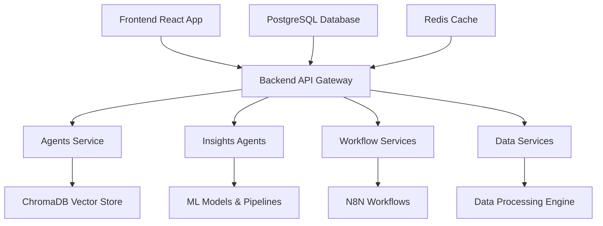

# GenieML Platform - Agentic Coworker Documentation

Welcome to the GenieML Platform documentation! This comprehensive guide provides high-level architecture overviews for each microservice in our AI-powered data analytics platform.

## 🏗️ Platform Overview

GenieML is a sophisticated AI-powered data analytics platform that combines multiple specialized services to provide end-to-end data science and business intelligence capabilities. The platform is built using a microservices architecture with each service handling specific aspects of the data analytics workflow.

## 📋 Services Overview

| Service | Port | Purpose | Technology Stack |
|---------|------|---------|------------------|
| [Agents Service](./agents/README.md) | 8020 | AI-powered SQL generation, dashboard creation, and report writing | FastAPI, LangChain, ChromaDB |
| [Insights Agents](./insightsagents/README.md) | 8025 | ML pipeline generation, data analysis, and insights extraction | FastAPI, LangGraph, Pandas, Scikit-learn |
| [Workflow Services](./workflowservices/README.md) | 8030 | Workflow orchestration, N8N integration, and task management | FastAPI, N8N, AsyncIO |
| [Backend Service](./backend/README.md) | 8000 | User management, authentication, and core API | FastAPI, PostgreSQL, JWT |
| [Frontend Service](./frontend/README.md) | 3000 | React-based user interface | React, Material-UI, Context API |
| [Data Services](./dataservices/README.md) | 8035 | Data processing and transformation | FastAPI, Pandas, Polars |
| [Data Engine](./dataengine/README.md) | 8040 | Data pipeline orchestration | FastAPI, Apache Airflow |
| [SQL Helper](./sql_helper/README.md) | 8045 | SQL query assistance and optimization | FastAPI, SQLAlchemy |

## 🔄 Data Flow Architecture



## 🚀 Quick Start

1. **Clone the repository**
2. **Set up environment variables** (see individual service READMEs)
3. **Start services using Docker Compose**:
   ```bash
   docker-compose up -d
   ```
4. **Access the frontend** at `http://localhost:3000`

## 📚 Documentation Structure

Each service has its own detailed documentation covering:
- Architecture overview
- Key components and features
- API endpoints
- Configuration options
- Deployment instructions
- Integration patterns

## 🔧 Development

- **Backend Services**: Python 3.11+, FastAPI, SQLAlchemy
- **Frontend**: React 18+, Material-UI, Context API
- **Database**: PostgreSQL 15+
- **Vector Store**: ChromaDB
- **Cache**: Redis
- **Containerization**: Docker & Docker Compose

## 📞 Support

For technical support or questions about the platform architecture, please refer to the individual service documentation or contact the development team.

---

*Last updated: December 2024*
