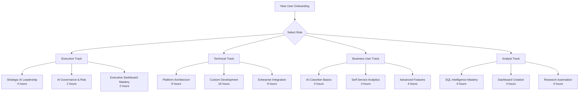

# Site Navigation & Resources
*Complete guide to all documentation, resources, and support materials*

[← Back to Overview](./index.md)

---

## 🗺️ Complete Site Map

### 📋 Business Decision-Making Resources
*For executives, business leaders, and strategic planning*

#### **Strategic Overview**
- **[Homepage](./index.md)** - Business overview and value proposition  
- **[Pricing & ROI](./pricing.md)** - Investment analysis and value quantification
- **[Getting Started](./getting-started.md)** - Implementation roadmap and success patterns
- **[60-Day Pilot Program](./pilot-program.md)** - Risk-free evaluation with guaranteed ROI

#### **Five Types of AI Coworkers** 
- **[All AI Agents](../agents/)** - Complete directory of all 5 types of AI coworkers
- **[Knowledge Agents](../agents/knowledge-graph-agents/)** - Structured knowledge management and reasoning
- **[Web Search Agents](../agents/web-search-agents/)** - Real-time research and data enrichment
- **[Data Agents](../agents/)** - SQL intelligence, dashboard creation, document analysis
- **[Semantic Agents](../agents/semantic/)** - Intelligent data storytelling and semantic modeling
- **[Insight Agents](../agents/insight-agents/)** - Advanced analytics and business intelligence *(Coming Soon)*
- **[ML Agents](../agents/ml-agents/)** - Machine learning model development *(Coming Soon)*
- **[Workflow Agents](../agents/workflow-agents/)** - Process automation and orchestration *(Coming Soon)*
- **[Integration Agents](../agents/integration-agents/)** - Visualization and communication *(Coming Soon)*

#### **Governance & Risk Management**
- **[Compliance & Security](./compliance.md)** - Enterprise compliance framework and security controls

---

### 🔧 Technical Implementation Resources  
*For IT teams, data engineers, and technical implementers*

#### **Platform Architecture**
- **[Technical Architecture](./architecture.md)** - System design, Self-RAG foundation, and infrastructure
- **[Implementation Guide](./implementation.md)** - Deployment procedures, configuration, and optimization

#### **Integration Documentation** *(Extend as needed)*
```
docs/integrations/
├── crm-integration.md          # Salesforce, HubSpot, Pipedrive integration
├── database-integration.md     # PostgreSQL, MySQL, Snowflake, BigQuery  
├── bi-tools-integration.md     # Tableau, PowerBI, Looker integration
├── cloud-platforms.md         # AWS, Azure, GCP deployment patterns
├── workflow-automation.md     # N8n, Zapier, custom workflow integration
└── api-integration.md         # Custom API development and webhook setup
```

#### **Development Resources** *(Extend as needed)*
```
docs/development/
├── agent-development.md       # Custom agent creation and deployment
├── api-reference.md          # Complete API documentation with examples
├── sdk-documentation.md      # Python, R, JavaScript client libraries
├── testing-framework.md     # Testing procedures and validation methods
├── performance-tuning.md    # Optimization and scaling best practices
└── troubleshooting.md       # Common issues and resolution procedures
```

---

## 📚 Resource Library by Role

### For Chief Executive Officers
**Strategic AI adoption and competitive positioning**

#### **Essential Reading**
- **[Business Overview](./index.md#business-impact--roi-analysis)** - Executive summary and strategic value
- **[ROI Analysis](./pricing.md#roi-calculator--value-analysis)** - Investment justification and returns
- **[Pilot Program](./pilot-program.md)** - Risk-free evaluation approach
- **[Competitive Advantage](./index.md#self-rag-foundation-architecture)** - Technology differentiation

#### **Board Presentation Materials**
```
Executive Board Package:
├── 📊 Business case presentation (15 slides)
├── 💰 ROI analysis with industry benchmarks
├── 🏆 Competitive positioning and differentiation
├── 📈 Strategic implementation roadmap
├── 🔒 Risk mitigation and security framework
└── 📞 Implementation timeline and resource requirements

Download: [Executive Board Package](mailto:board-materials@datascience-coworkers.com)
```

### For Chief Financial Officers
**Investment analysis and cost-benefit evaluation**

#### **Financial Analysis Resources**
- **[Cost-Benefit Analysis](./pricing.md#total-cost-of-ownership-analysis)** - 3-year TCO comparison
- **[ROI Calculator](./pricing.md#roi-calculator--value-analysis)** - Interactive financial modeling
- **[Compliance Costs](./compliance.md#compliance-cost-benefit-analysis)** - Compliance automation savings
- **[Implementation Investment](./pricing.md#implementation--professional-services)** - Professional services and deployment costs

#### **Financial Performance Tracking**
```
CFO Analytics Dashboard:
├── Real-time cost savings measurement
├── Productivity gains financial impact  
├── Compliance cost reduction tracking
├── Strategic initiative ROI validation
├── Budget optimization recommendations
└── Investment payback period monitoring

Access: Included in Enterprise tier implementation
```

### For Chief Technology Officers
**Technical architecture and implementation planning**

#### **Technical Deep Dive Resources**  
- **[System Architecture](./architecture.md)** - Complete technical architecture and design patterns
- **[Implementation Guide](./implementation.md)** - Detailed deployment and configuration procedures
- **[Security Framework](./compliance.md#data-security-framework)** - Enterprise security controls and validation
- **[Performance Optimization](./implementation.md#performance-optimization)** - Scalability and performance tuning

#### **Integration Planning Tools**
```
Technical Assessment Package:
├── 🏗️ Architecture review and recommendations
├── 🔌 Integration feasibility analysis  
├── 🔒 Security and compliance gap assessment
├── ⚡ Performance and scalability planning
├── 🛠️ Implementation timeline and resource planning
└── 📈 Technical success metrics and monitoring

Request: [Technical Assessment](mailto:technical@datascience-coworkers.com)
```

### For Data Science Teams
**AI coworker capabilities and technical implementation**

#### **Data Science Resources**
- **[Data Science Agents](./datascience-agents.md)** - ML automation and pipeline generation capabilities
- **[Technical Implementation](./implementation.md#insights-agents-service-port-8025)** - ML service architecture and deployment
- **[Self-RAG Technology](./architecture.md#self-rag-foundation-with-reinforcement-learning)** - Core AI technology explanation
- **[Custom Development](./datascience-agents.md#advanced-ml-capabilities)** - Custom model and agent development

#### **Hands-On Resources**
```
Data Science Toolkit:
├── 🧪 Jupyter notebook templates and examples
├── 🔬 Sample ML pipelines and code generation
├── 📊 Model performance monitoring and optimization
├── 🤖 Custom agent development frameworks
├── 📈 MLOps integration and deployment patterns
└── 🔄 Continuous learning and model improvement

Access: Available during pilot program and full deployment
```

### For Business Analysts
**Self-service analytics and business intelligence**

#### **Business Analytics Resources**
- **[SQL Intelligence](./sql-agents.md)** - Natural language to SQL conversion capabilities
- **[Dashboard Creation](./dashboard-agents.md)** - Automated BI and visualization
- **[Research Capabilities](./research-agents.md)** - Market intelligence and competitive analysis
- **[Getting Started](./getting-started.md#quick-start-30-minute-first-success)** - Immediate value demonstration

#### **Training Materials**
```
Business Analyst Success Kit:
├── 📝 Quick reference guides for each agent type
├── 🎥 Video tutorials for common business scenarios
├── 📊 Template dashboards and report formats  
├── 💡 Best practice examples from similar organizations
├── 🎯 Advanced technique training and optimization
└── 🤝 Peer learning community access

Included: All training materials provided during implementation
```

---

## 🎯 Resource Organization by Implementation Phase

### Phase 1: Evaluation & Planning
**Before pilot program starts**

#### **Decision-Making Resources**
```
Pre-Pilot Resource Kit:
├── 📋 Business case template and ROI calculator
├── 🏗️ Technical requirements assessment checklist
├── 🔒 Security and compliance requirements framework  
├── 👥 Team readiness assessment and training planning
├── 📅 Implementation timeline template and milestone tracking
└── 💼 Executive presentation materials and business case

Timeline: 2-4 weeks for comprehensive evaluation
Outcome: Go/no-go decision with complete implementation plan
```

### Phase 2: Pilot Execution  
**During 60-day pilot program**

#### **Active Implementation Support**
```
Pilot Support Resources:
├── 🚀 Weekly implementation guides and checklists
├── 📊 Real-time ROI tracking dashboard and analytics
├── 🎓 Progressive training modules and skill development
├── 🔧 Technical support and troubleshooting resources
├── 📈 Performance optimization recommendations
└── 💬 Direct access to implementation team via Slack/Teams

Frequency: Daily support availability with weekly structured reviews
Outcome: Validated business impact and technical success
```

### Phase 3: Production Deployment
**After successful pilot completion**

#### **Scale-Up Resources**
```
Production Deployment Kit:
├── 🏭 Enterprise deployment architecture and scaling guides  
├── 👥 Organization-wide training curriculum and certification
├── 🔄 Continuous improvement framework and optimization
├── 📊 Advanced analytics and strategic intelligence capabilities
├── 🤝 Best practices community and peer learning network
└── 🎯 Strategic consulting and AI transformation planning

Duration: 3-12 months depending on organization size and complexity
Outcome: Full organizational AI transformation and competitive advantage
```

---

## 🔗 External Resources & Partnerships

### Industry Resources

#### **Regulatory & Compliance**
- **SOC 2**: [AICPA SOC 2 Guidelines](https://www.aicpa.org/soc2)
- **GDPR**: [EU GDPR Portal](https://gdpr.eu/)  
- **HIPAA**: [HHS HIPAA Guidelines](https://www.hhs.gov/hipaa/)
- **EU AI Act**: [Official EU AI Act Text](https://eur-lex.europa.eu/eli/reg/2024/1689)
- **Financial Regulations**: Fed, FDIC, OCC guidance on AI in banking

#### **Technology Standards**
- **ISO 27001**: Information security management systems
- **NIST Cybersecurity Framework**: Comprehensive security framework
- **OWASP**: Application security best practices  
- **AI Ethics**: Partnership with AI ethics organizations
- **Open Source**: Contributions to open source AI safety and governance

### Strategic Partnerships

#### **Technology Partners**
```
Integration Ecosystem:
├── 📊 Business Intelligence: Tableau, PowerBI, Looker, Qlik
├── 🗄️ Data Platforms: Snowflake, Databricks, AWS Redshift, BigQuery
├── 🔄 Workflow Automation: N8n, Zapier, Microsoft Power Automate
├── 💼 CRM Systems: Salesforce, HubSpot, Microsoft Dynamics
├── 🔒 Security: Okta, Azure AD, HashiCorp Vault, CyberArk
└── ☁️ Cloud Infrastructure: AWS, Azure, Google Cloud, hybrid deployments

Partnership Benefits:
├── Certified integrations with reduced implementation time
├── Joint customer support and technical troubleshooting
├── Co-developed features and enhanced platform capabilities  
├── Preferred pricing and implementation packages
└── Joint go-to-market and customer success programs
```

#### **Professional Services Partners**
```
Implementation Partner Network:
├── 🏛️ System Integrators: Deloitte, PwC, KPMG, EY (Big 4 partnerships)
├── 🏢 Industry Specialists: Financial services, healthcare, manufacturing consultants
├── 🔧 Technology Integrators: Cloud migration and digital transformation specialists
├── 📊 Analytics Consultants: Data strategy and business intelligence specialists
└── 🔒 Security & Compliance: Cybersecurity and regulatory compliance experts

Partner Capabilities:
├── Industry-specific implementation and customization
├── Regulatory compliance consulting and validation
├── Change management and organizational transformation  
├── Advanced custom development and integration services
└── Ongoing optimization and strategic consulting
```

---

## 📞 Contact & Support Directory

### Quick Contact Guide

#### **By Role & Need**
```
Business Leaders:
├── 💼 Executive Consultation: executive@datascience-coworkers.com
├── 💰 Pricing & ROI Questions: pricing@datascience-coworkers.com  
├── 🎯 Pilot Program: pilot@datascience-coworkers.com
└── 📈 Strategic Planning: strategy@datascience-coworkers.com

Technical Teams:
├── 🔧 Technical Sales: solutions@datascience-coworkers.com
├── 🏗️ Implementation Support: implementation@datascience-coworkers.com
├── 🔌 Integration Questions: integrations@datascience-coworkers.com
└── 🛠️ Developer Resources: developers@datascience-coworkers.com

Support & Success:
├── 🎓 Training & Enablement: training@datascience-coworkers.com
├── ✅ Customer Success: success@datascience-coworkers.com
├── 🆘 Technical Support: support@datascience-coworkers.com
└── 🤝 Partnership Opportunities: partners@datascience-coworkers.com
```

#### **Global Contact Information**
```
Regional Offices:

North America (Headquarters):
├── Address: 123 AI Innovation Drive, Palo Alto, CA 94301
├── Phone: +1 (555) AGENTS-1 [+1 (555) 243-6871]
├── Hours: 6 AM - 6 PM PST (Business), 24/7 (Emergency)
└── Languages: English, Spanish

Europe (GDPR/EU AI Act Compliance):
├── Address: 45 Tech Quarter, Dublin 2, Ireland  
├── Phone: +353 1 XXX XXXX
├── Hours: 9 AM - 5 PM GMT (Business), 24/7 (Emergency)
└── Languages: English, German, French, Dutch

Asia-Pacific (Expansion):
├── Address: 78 Innovation Hub, Singapore 049909
├── Phone: +65 XXXX XXXX  
├── Hours: 9 AM - 6 PM SGT (Business)
└── Languages: English, Mandarin, Japanese
```

---

## 🎓 Learning & Development Resources

### Training Curriculum Overview

#### **Role-Based Learning Paths**


#### **Certification Programs**
```
Professional Certifications:

AI Executive Leadership Certificate:
├── Strategic AI adoption and business value realization
├── AI governance, risk management, and compliance
├── Organizational change management for AI transformation  
├── Executive decision-making with AI insights and analytics

Technical Implementation Specialist:
├── Platform architecture and Self-RAG technology deep-dive
├── Enterprise deployment and security configuration
├── Custom agent development and advanced integration
├── Performance optimization and troubleshooting expertise

Business AI Proficiency Certificate:  
├── Effective AI coworker collaboration and productivity
├── Self-service analytics and business intelligence creation
├── Process automation and workflow optimization  
├── Advanced feature utilization and business impact maximization

Certification Benefits:
✅ Industry recognition and career advancement
✅ Access to exclusive advanced training and resources
✅ Direct connection with AI experts and community
✅ Continued education and platform update training
```

### Knowledge Base & Documentation

#### **Self-Service Documentation Portal**
```
Documentation Categories:

Getting Started:
├── 🚀 Quick start guide (30-minute value demonstration)
├── 📋 Business requirements and readiness assessment
├── 🎯 Use case prioritization and success pattern identification
├── 👥 Team preparation and change management planning
└── 📊 Success metrics definition and measurement framework

Technical Implementation:
├── 🏗️ Platform architecture and infrastructure requirements
├── 🔧 Step-by-step deployment and configuration procedures
├── 🔌 Integration guides for common systems and data sources
├── 🔒 Security configuration and compliance validation
└── ⚡ Performance optimization and scalability planning

Agent Capabilities:
├── 🤖 Detailed capability description for each agent type
├── 💼 Business use case examples with sample outputs
├── 🔧 Configuration options and customization procedures
├── 📈 Performance characteristics and optimization techniques
└── 🎯 Best practices and common pitfalls avoidance

Advanced Topics:
├── 🧠 Self-RAG technology explanation and technical details
├── 🔄 Reinforcement learning and continuous improvement
├── 🏭 Enterprise scaling and multi-environment deployment
├── 🤝 Custom development and professional services
└── 🌐 Multi-tenant architecture and data isolation
```

---

## 🤝 Community & Support Ecosystem

### User Community Platform

#### **Community Features**
```
AI Coworker User Community:

Discussion Forums:
├── 💬 General Discussion: Best practices and experience sharing
├── 🔧 Technical Q&A: Implementation and troubleshooting help
├── 💼 Industry Groups: Finance, healthcare, manufacturing, technology
├── 🎯 Use Case Sharing: Successful implementations and lessons learned
└── 🚀 Feature Requests: Platform enhancement suggestions and voting

Resource Sharing:
├── 📚 Template Library: Dashboards, reports, and workflow templates
├── 🔧 Code Examples: Custom agent implementations and integrations
├── 📊 Best Practices: Optimization techniques and performance improvements
├── 🏆 Success Stories: Case studies and ROI achievement examples  
└── 🎓 Training Materials: User-generated guides and tutorials

Community Benefits:
✅ Peer-to-peer learning and knowledge sharing
✅ Direct access to product team and expert advice
✅ Early access to new features and beta testing opportunities
✅ Networking with AI leaders and practitioners
✅ Recognition and awards for community contributions
```

#### **Expert Office Hours**
```
Weekly Expert Sessions:

Monday: Technical Architecture Office Hours
├── Time: 2 PM EST / 11 AM PST / 7 PM GMT
├── Expert: Platform Architect  
├── Focus: Technical implementation, integration, performance
└── Format: Open Q&A with screenshare and live problem-solving

Wednesday: Business Value Office Hours  
├── Time: 1 PM EST / 10 AM PST / 6 PM GMT
├── Expert: Customer Success Director
├── Focus: ROI optimization, use case expansion, business impact
└── Format: Strategic discussion with business case development

Friday: Industry Compliance Office Hours
├── Time: 3 PM EST / 12 PM PST / 8 PM GMT  
├── Expert: Compliance and Security Director
├── Focus: Regulatory requirements, security controls, audit preparation
└── Format: Compliance Q&A with regulatory expertise

Monthly: Executive Strategy Session
├── Time: First Thursday of month, 2 PM EST
├── Expert: VP of Strategy and Executive Team
├── Focus: Strategic AI adoption, competitive positioning, transformation planning
└── Format: Executive roundtable with strategic planning focus
```

---

## 📊 Success Metrics & Benchmarking

### Industry Benchmarking Data

#### **Peer Organization Performance Comparison**
```
Industry Performance Benchmarks:

Financial Services (50+ implementations):
├── Average ROI: 340% first year (range: 180-520%)
├── Implementation Time: 6.2 weeks average (range: 4-12 weeks)  
├── User Adoption: 89% average (range: 67-98%)
├── Productivity Improvement: 387% average (range: 200-650%)
├── Compliance Efficiency: 78% reduction in manual compliance work

Healthcare Organizations (30+ implementations):  
├── Average ROI: 410% first year (range: 220-680%)
├── Implementation Time: 8.1 weeks average (range: 6-14 weeks)
├── User Adoption: 92% average (range: 78-99%)
├── Research Acceleration: 425% faster literature reviews
├── Clinical Outcomes: 18% average improvement in quality metrics

Manufacturing Companies (25+ implementations):
├── Average ROI: 295% first year (range: 160-450%)
├── Implementation Time: 7.3 weeks average (range: 5-11 weeks)
├── User Adoption: 85% average (range: 72-96%)  
├── Operational Efficiency: 67% improvement in process automation
├── Quality Improvement: 34% reduction in defects and errors

Technology Companies (40+ implementations):
├── Average ROI: 380% first year (range: 240-580%)
├── Implementation Time: 5.8 weeks average (range: 3-9 weeks)
├── User Adoption: 94% average (range: 83-99%)
├── Development Velocity: 15x faster model development and deployment
├── Innovation Acceleration: 45% more experiments and product iterations
```

#### **Success Factor Analysis**
```
Top Success Factors (from 150+ implementations):

1. Executive Sponsorship (94% correlation with success):
   ├── Clear executive champion and strategic vision
   ├── Adequate budget allocation and resource commitment
   ├── Regular executive review and strategic guidance
   └── Organization-wide communication and change management

2. Technical Readiness (89% correlation with success):
   ├── Clean, accessible data with documented schemas
   ├── Existing BI/analytics infrastructure and expertise
   ├── IT team engagement and technical support
   └── Integration capabilities and system connectivity

3. User Engagement (87% correlation with success):
   ├── Dedicated pilot team with business domain expertise
   ├── Active participation in training and feedback sessions  
   ├── Internal champion development and peer advocacy
   └── Regular usage and iterative improvement collaboration

4. Clear Success Criteria (85% correlation with success):
   ├── Quantifiable business objectives and KPIs
   ├── Realistic timeline expectations and milestone planning
   ├── Regular progress measurement and course correction
   └── Strategic alignment with business objectives and priorities
```

---

## 🌟 Next Steps & Expansion Planning

### Post-Pilot Growth Strategy

#### **Organizational Scaling Framework**
```
AI Transformation Maturity Model:

Level 1: Pilot Success (Month 1-2)
├── Core team productivity transformation
├── Initial business process automation
├── Foundational compliance and security establishment
└── Measurable ROI demonstration and validation

Level 2: Department Expansion (Month 3-6)  
├── Multi-department deployment and workflow integration
├── Advanced analytics and predictive modeling deployment
├── Cross-functional process automation and optimization
└── Strategic decision-making acceleration and improvement

Level 3: Organization-Wide Transformation (Month 6-12)
├── Enterprise-wide AI coworker deployment and adoption
├── Advanced custom development and competitive differentiation  
├── Strategic AI advantage and market positioning
└── Continuous innovation and AI-first organizational culture

Level 4: AI Leadership (Month 12+)
├── Industry thought leadership and best practice sharing
├── Advanced AI research and development collaboration
├── Strategic partnerships and ecosystem development  
└── Market leadership in AI-powered business transformation
```

#### **Strategic Expansion Opportunities**
```
Expansion Strategy Options:

Geographic Expansion:
├── Multi-region deployment for global organizations
├── Local compliance configuration for international regulations
├── Cultural adaptation and localization for regional markets
└── Strategic partnership development for market entry

Capability Expansion:
├── Advanced AI research and development collaboration
├── Custom AI model development for competitive advantage
├── Industry-specific agent development and optimization
└── Strategic consulting and transformation advisory services

Ecosystem Expansion:
├── Third-party developer platform and marketplace
├── Customer success community and best practice sharing
├── Academic research partnership and thought leadership
└── Industry consortium participation and standards development
```

---

## 📈 Continuous Learning & Innovation

### Platform Evolution Roadmap

#### **Planned Enhancements (2025)**
```
Q1 2025: Enhanced Self-RAG Capabilities
├── Advanced reinforcement learning with business outcome optimization
├── Multi-modal AI integration (text, image, voice interaction)
├── Real-time learning and adaptation based on user feedback
└── Enhanced explainability and decision transparency

Q2 2025: Industry Specialization  
├── Financial services compliance automation expansion
├── Healthcare clinical decision support enhancement
├── Manufacturing predictive maintenance and quality optimization
└── Regulatory compliance automation for emerging regulations

Q3 2025: Advanced Integration & Automation
├── No-code/low-code agent development platform
├── Advanced workflow automation with intelligent decision-making
├── Real-time streaming analytics and event processing
└── Mobile-first agent interaction and management

Q4 2025: AI Ecosystem Platform
├── Third-party developer marketplace and ecosystem
├── Advanced partnership integrations and pre-built solutions
├── AI ethics and responsible AI framework enhancement
└── Next-generation AI technology integration and research
```

---

**Ready to start your AI transformation journey?** 

### 🚀 Take Action Today
- **[Apply for 60-Day Pilot](mailto:pilot@datascience-coworkers.com)** - Risk-free evaluation with guaranteed ROI
- **[Schedule Executive Briefing](mailto:executive@datascience-coworkers.com)** - Strategic overview for leadership team
- **[Request Technical Deep Dive](mailto:technical@datascience-coworkers.com)** - Architecture review for technical teams
- **[Custom Evaluation Program](mailto:custom@datascience-coworkers.com)** - Tailored assessment for unique requirements

---

*Transform your organization's capabilities with AI coworkers. Comprehensive support, guaranteed success, and measurable business impact await.*

**📚 Complete Documentation:** [Technical Architecture](./architecture.md) | [Implementation Guide](./implementation.md) | [Compliance Framework](./compliance.md) | [All Agent Types](./index.md#-five-types-of-ai-coworkers)