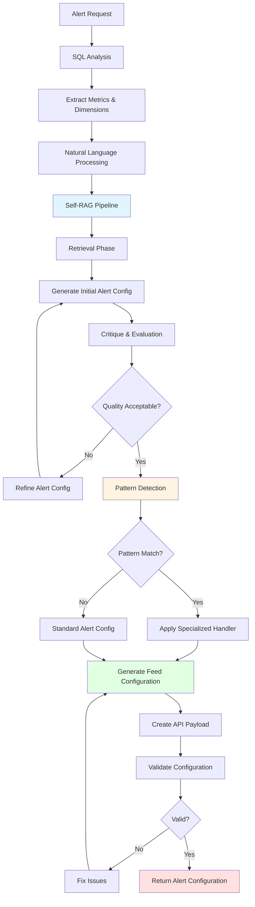
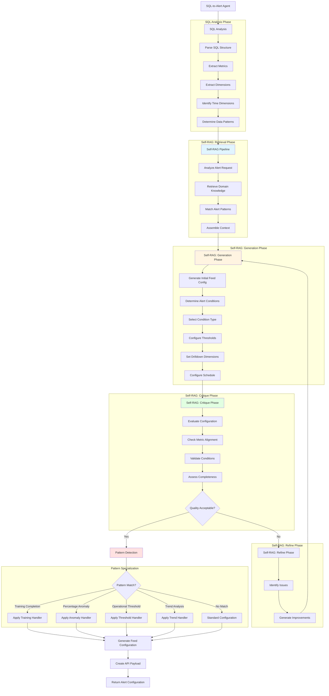
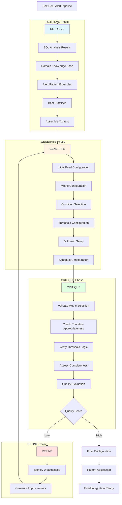
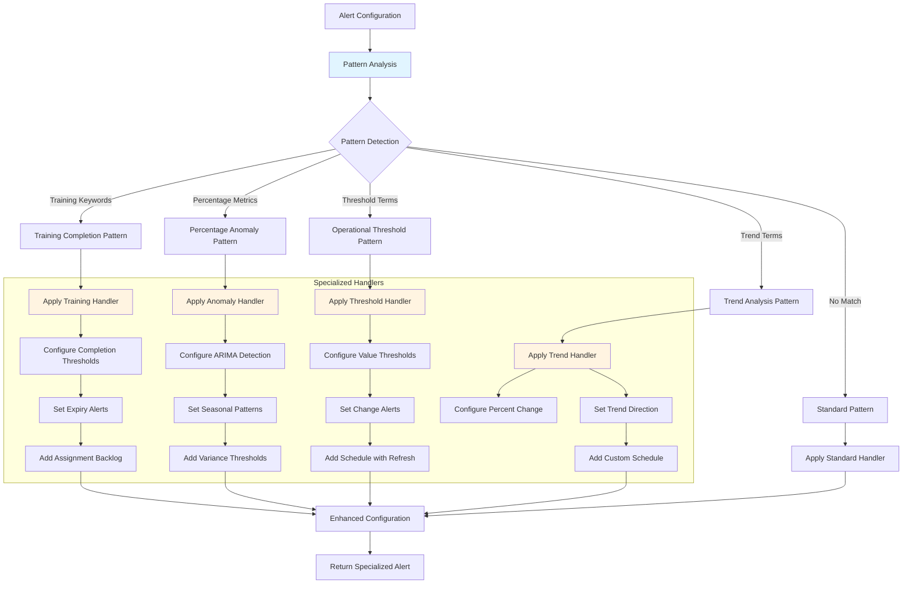
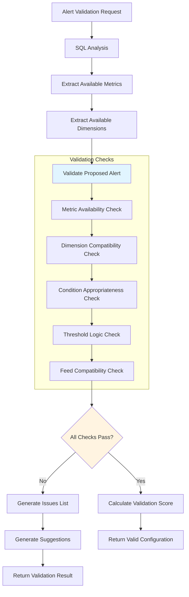
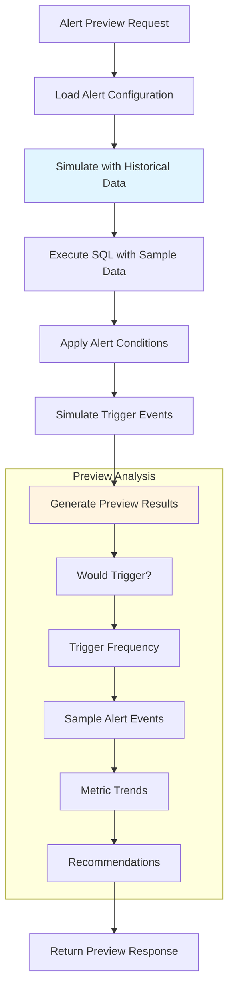
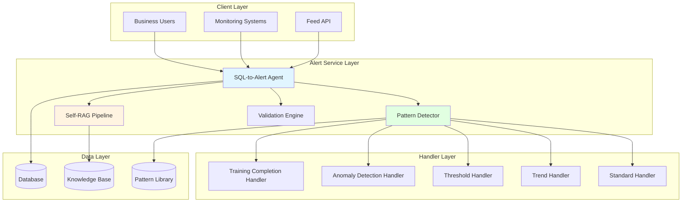
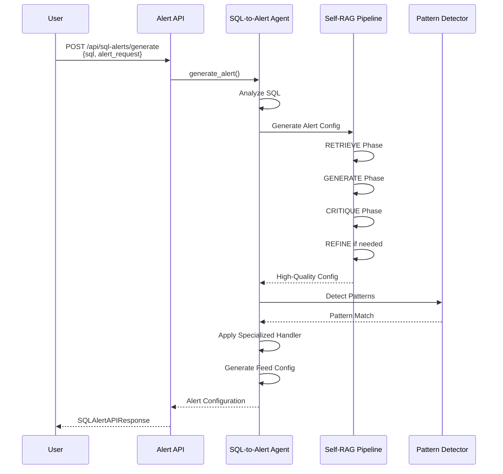
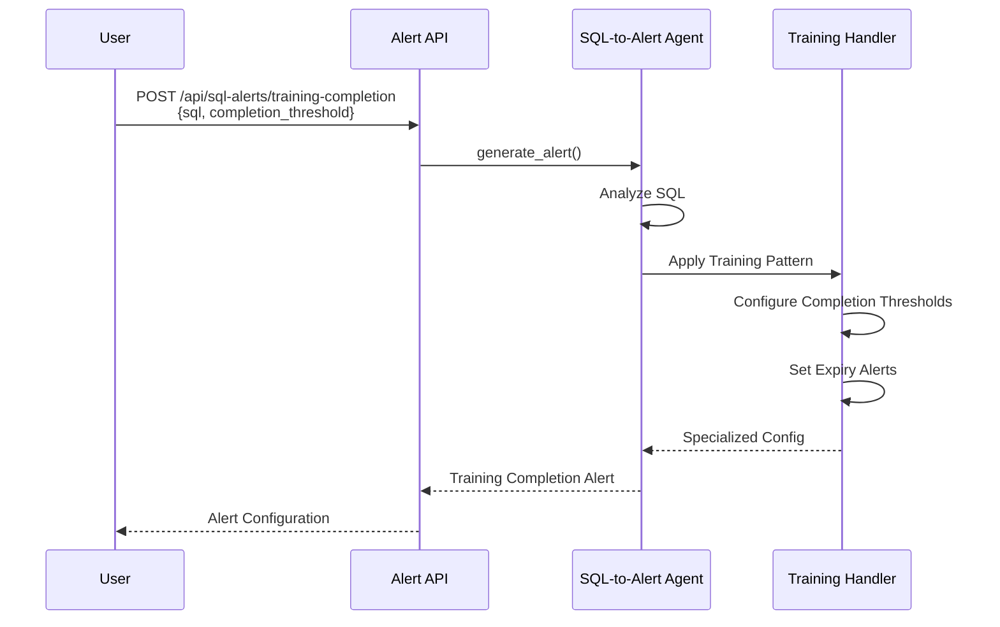

# Alert Service Flow Diagrams

This document provides comprehensive flowcharts explaining how the SQL-to-Alert Service works, enabling business users to create intelligent alerts and monitoring configurations from SQL queries in minutes.

## Purpose & Business Value

**Transform SQL Queries into Intelligent Monitoring Alerts Instantly**

The Alert Service enables business professionals to convert their SQL queries and natural language alert requests into production-ready alert configurations for monitoring systems. This capability delivers significant organizational value:

- **💰 Cost Savings**: Eliminates dependency on DevOps or data engineering teams for alert setup and configuration
- **⚡ Speed to Value**: Business users can create sophisticated alert configurations in **minutes** instead of waiting days for engineering support
- **🔔 Intelligent Alert Generation**: Uses Self-RAG architecture to automatically determine optimal alert conditions and thresholds
- **📊 Pattern Detection**: Recognizes common alert patterns (training completion, anomaly detection, thresholds) and applies specialized configurations
- **🎯 Business Context Aware**: Understands business requirements and generates alerts aligned with operational needs
- **🔄 Feed Integration**: Directly integrates with monitoring systems (Tellius Feed) for immediate deployment
- **✅ Validation & Preview**: Built-in validation and preview capabilities ensure alerts work correctly before deployment

## Table of Contents

1. [Alert Generation Flow](#alert-generation-flow)
2. [Self-RAG Alert Pipeline](#self-rag-alert-pipeline)
3. [Pattern Detection & Specialization](#pattern-detection--specialization)
4. [Alert Validation & Preview](#alert-validation--preview)
5. [Alert Components & Architecture](#alert-components--architecture)
6. [API Endpoints Reference](#api-endpoints-reference)

---

## Alert Generation Flow

The Alert Service processes SQL queries and natural language alert requests to generate comprehensive alert configurations for monitoring systems.

### High-Level Alert Generation Flow

### Detailed Alert Pipeline

---

## Self-RAG Alert Pipeline

The Alert Service uses a Self-Reflective RAG (Self-RAG) architecture that retrieves, generates, critiques, and refines alert configurations iteratively.

### Self-RAG Flow Diagram

---

## Pattern Detection & Specialization

The Alert Service automatically detects common alert patterns and applies specialized handlers for optimal configuration.

### Pattern Detection Flow

### Common Alert Patterns

| Pattern | Description | Typical Metrics | Condition Types |
|---------|-------------|----------------|-----------------|
| **Training Completion** | Alerts for training completion rates, backlogs, expiry | completion_percentage, assigned_count, expired_percentage | threshold_value, threshold_percent_change |
| **Percentage Anomaly** | Anomaly detection for percentage-based metrics | conversion_rate, completion_rate, satisfaction_score | intelligent_arima |
| **Operational Threshold** | Simple threshold alerts for operational metrics | count, sum, average | threshold_value, threshold_change |
| **Trend Analysis** | Trend-based alerts for strategic metrics | revenue, user_growth, performance_score | threshold_percent_change, intelligent_arima |

---

## Alert Validation & Preview

The Alert Service provides validation and preview capabilities to ensure alerts work correctly before deployment.

### Validation Flow

### Preview Flow

---

## Alert Components & Architecture

### Component Architecture

---

## Key Components Summary

### Alert Service Components

| Component | Purpose | Output |
|-----------|---------|--------|
| **SQL-to-Alert Agent** | Main agent that converts SQL to alert configurations | Complete Feed alert configuration |
| **SQL Analyzer** | Analyzes SQL queries to extract metrics and dimensions | SQL analysis with metrics and dimensions |
| **Self-RAG Pipeline** | Self-reflective pipeline for generating and refining alerts | High-quality alert configurations |
| **Pattern Detector** | Detects common alert patterns and applies specialized handlers | Pattern-matched alert configuration |
| **Feed Configuration Generator** | Creates Tellius Feed-compatible configurations | Feed configuration JSON |
| **Validation Engine** | Validates alert configurations before deployment | Validation results with suggestions |
| **Preview Simulator** | Simulates alert behavior with historical data | Preview results and recommendations |

### Alert Condition Types

| Condition Type | Description | Use Cases |
|----------------|-------------|-----------|
| **intelligent_arima** | Automatic time-series anomaly detection using ARIMA | Seasonal data, trend detection, pattern anomalies |
| **threshold_value** | Simple value-based threshold alerts | SLA monitoring, capacity limits, business rules |
| **threshold_change** | Absolute change from previous period | Growth tracking, decline detection |
| **threshold_percent_change** | Percentage change from previous period | Relative performance, percentage tracking |

---

## API Endpoints Reference

### Alert Generation

- `POST /api/sql-alerts/generate` - Generate Feed alert configuration from SQL and natural language
- `POST /api/sql-alerts/batch` - Generate multiple alerts in batch with parallel processing

### Alert Specialization

- `POST /api/sql-alerts/training-completion` - Specialized endpoint for training completion alerts
- `POST /api/sql-alerts/percentage-anomaly` - Specialized endpoint for percentage-based anomaly detection

### Alert Utilities

- `POST /api/sql-alerts/validate` - Validate alert configuration
- `POST /api/sql-alerts/preview` - Preview alert behavior with historical data
- `POST /api/sql-alerts/feed-integration` - Directly integrate with Feed API
- `GET /api/sql-alerts/patterns` - Get supported alert patterns
- `GET /api/sql-alerts/feed-conditions` - Get available Feed condition types
- `DELETE /api/sql-alerts/sessions/{session_id}` - Clear alert generation session

---

## Request/Response Examples

### Example 1: Standard Alert Generation

### Example 2: Training Completion Alert

---

## Notes

- **Business Impact**: Enables business users to create sophisticated alert configurations in minutes, eliminating days of waiting for DevOps support
- **Self-RAG Architecture**: Uses self-reflective RAG for iterative improvement of alert configurations
- **Pattern Recognition**: Automatically detects common patterns and applies specialized configurations
- **Validation & Preview**: Built-in validation and preview capabilities ensure alerts work correctly
- **Feed Integration**: Direct integration with Tellius Feed for immediate deployment
- **Batch Processing**: Supports parallel processing for generating multiple alerts
- **Session Management**: Maintains context across multiple requests for iterative refinement
- **Pattern Library**: Extensive library of common alert patterns for various business scenarios

---

*Last Updated: [Current Date]*
*Version: 1.0*

