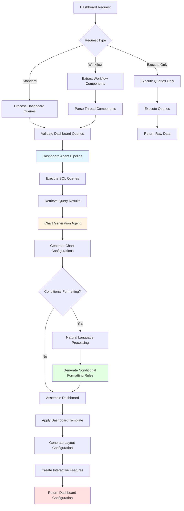
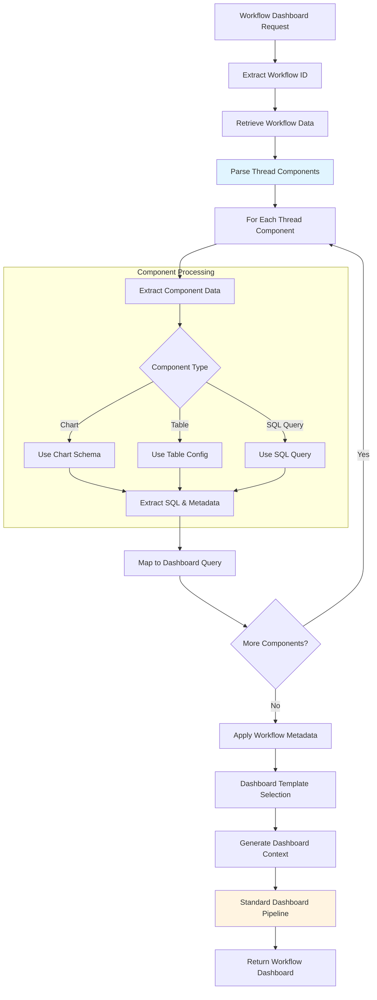
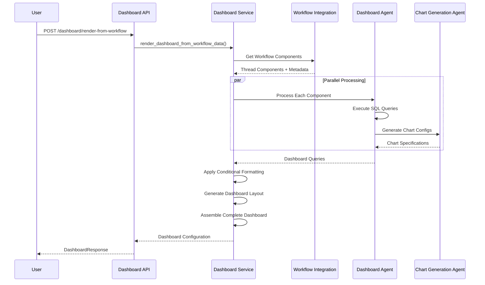
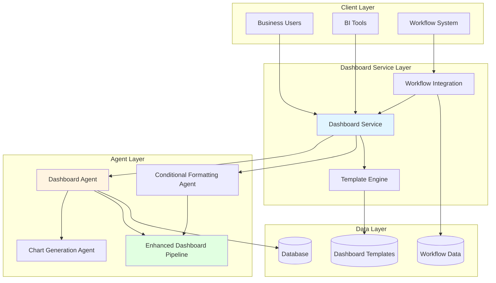
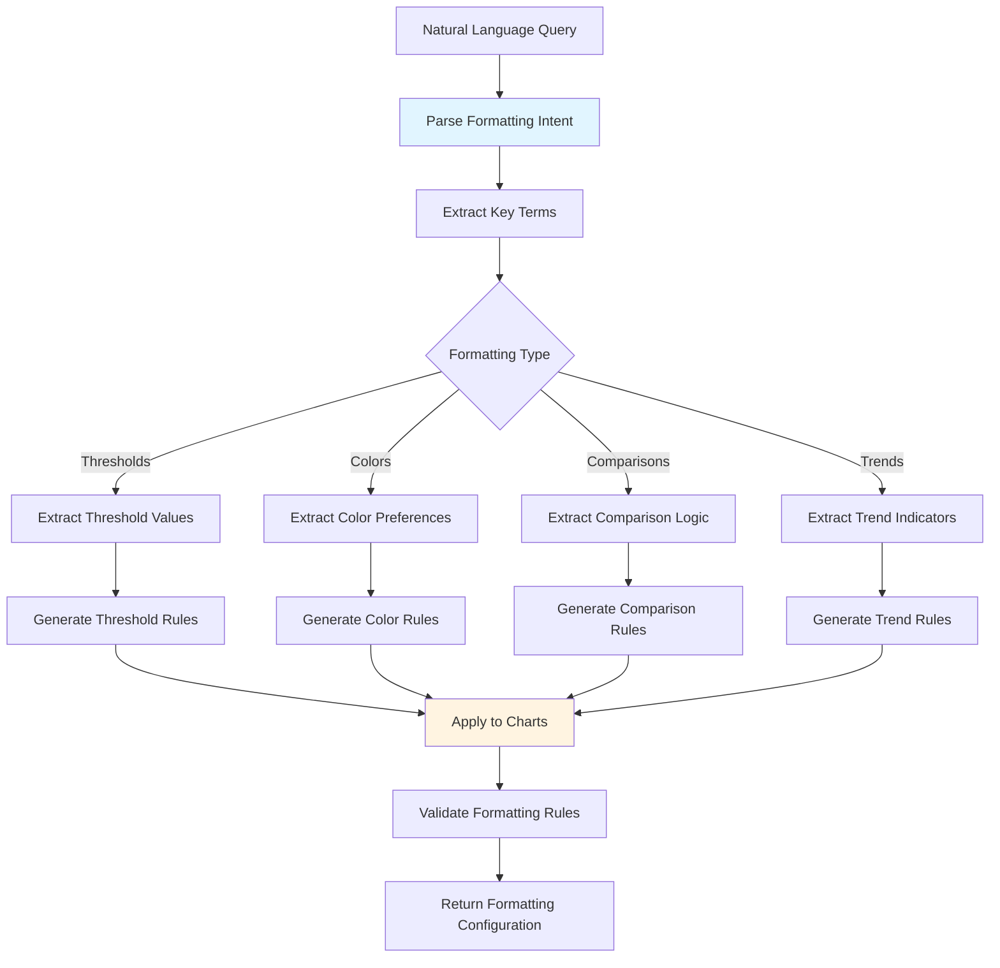
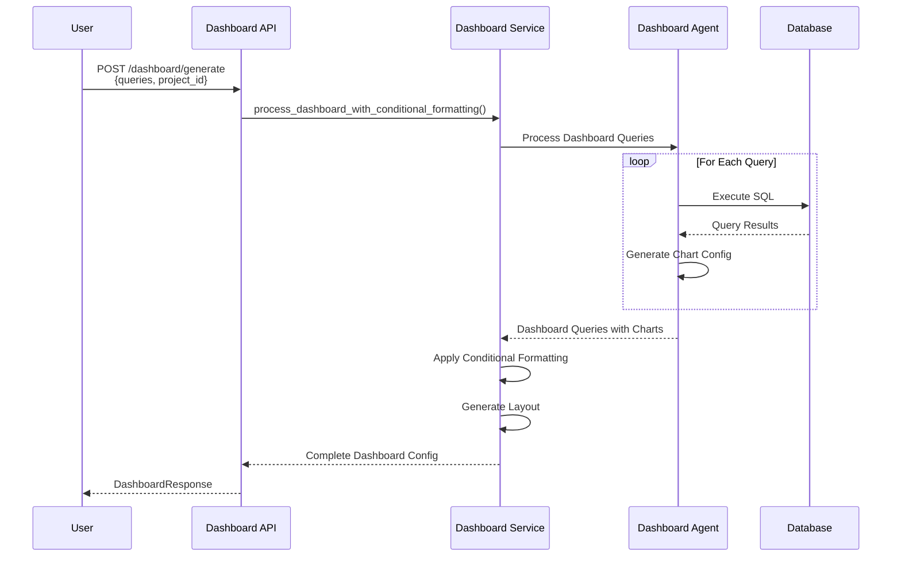
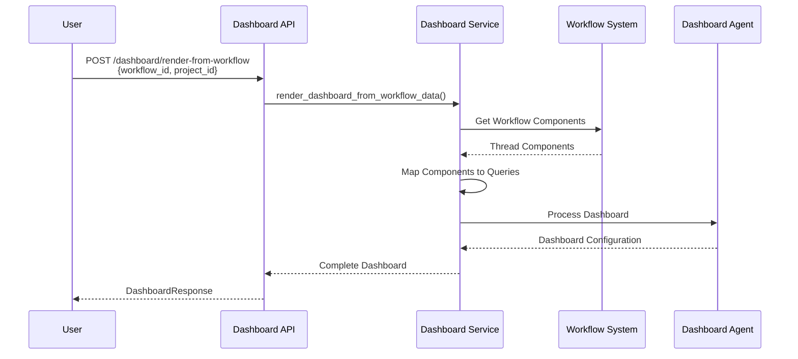

# Dashboard Service Flow Diagrams

This document provides comprehensive flowcharts explaining how the Dashboard Service works, enabling business users to create personalized, interactive dashboards in minutes.

## Purpose & Business Value

**Transform Data Queries into Personalized Dashboards Instantly**

The Dashboard Service enables business professionals to transform their SQL queries and natural language questions into fully functional, personalized dashboards for their BI tools. This capability delivers significant organizational value:

- **💰 Cost Savings**: Eliminates dependency on IT teams or dashboard developers for dashboard creation and customization
- **⚡ Speed to Value**: Business users can generate complete, production-ready dashboards in **minutes** instead of waiting days or weeks
- **🎯 Self-Service Dashboard Creation**: Non-technical users can create interactive dashboards with multiple charts, conditional formatting, and real-time updates
- **🔄 Workflow Integration**: Seamlessly integrates with existing workflows to automatically generate dashboards from question threads
- **📊 BI Tool Compatibility**: Generates dashboard configurations compatible with any business intelligence tool
- **🎨 Intelligent Layouts**: Automatically determines optimal dashboard layouts and chart arrangements based on data characteristics

## Table of Contents

1. [Dashboard Generation Flow](#dashboard-generation-flow)
2. [Workflow-Based Dashboard Generation](#workflow-based-dashboard-generation)
3. [Dashboard Components & Architecture](#dashboard-components--architecture)
4. [Conditional Formatting Flow](#conditional-formatting-flow)
5. [API Endpoints Reference](#api-endpoints-reference)

---

## Dashboard Generation Flow

The Dashboard Service processes SQL queries and natural language requests to generate comprehensive dashboard configurations with charts, layouts, and conditional formatting.

### High-Level Dashboard Generation Flow

### Detailed Dashboard Pipeline

```mermaid
flowchart TD
    D1[Dashboard Service: Process Request] --> D2{Input Type}
    
    D2 -->|Dashboard Queries| D3[Parse Dashboard Queries]
    D2 -->|Workflow Data| D4[Extract Workflow Components]
    
    D3 --> D5[Validate Query Structure]
    D4 --> D6[Map Components to Queries]
    D6 --> D5
    
    D5 --> D7[Dashboard Agent Pipeline]
    
    subgraph "Dashboard Agent Processing"
        D7 --> D8[For Each Query]
        D8 --> D9[Execute SQL Query]
        D9 --> D10[Retrieve Results]
        D10 --> D11[Analyze Data Structure]
        D11 --> D12[Chart Generation Agent]
        D12 --> D13[Determine Chart Type]
        D13 --> D14[Generate Vega-Lite Spec]
        D14 --> D15[Create Chart Metadata]
        D15 --> D16[Apply Chart Config]
    end
    
    D16 --> D17{All Queries Processed?}
    D17 -->|No| D8
    D17 -->|Yes| D18[Conditional Formatting Agent]
    
    subgraph "Conditional Formatting"
        D18 --> D19{Natural Language Query?}
        D19 -->|Yes| D20[Parse Formatting Requirements]
        D20 --> D21[Generate Formatting Rules]
        D21 --> D22[Apply Color Schemes]
        D22 --> D23[Create Threshold Rules]
        D23 --> D24[Link Rules to Charts]
        D19 -->|No| D25[Use Default Formatting]
        D25 --> D24
    end
    
    D24 --> D26[Enhanced Dashboard Pipeline]
    
    subgraph "Dashboard Assembly"
        D26 --> D27[Select Dashboard Template]
        D27 --> D28[Generate Layout Grid]
        D28 --> D29[Arrange Charts]
        D29 --> D30[Add Interactive Features]
        D30 --> D31[Configure Refresh Settings]
        D31 --> D32[Apply Theme & Styling]
        D32 --> D33[Generate Export Options]
    end
    
    D33 --> D34[Return Complete Dashboard]
    
    style D7 fill:#e1f5ff
    style D12 fill:#fff4e1
    style D18 fill:#e1ffe1
    style D26 fill:#ffe1e1
```

---

## Workflow-Based Dashboard Generation

The Dashboard Service can automatically generate dashboards from workflow data, extracting components from question threads and assembling them into cohesive dashboard configurations.

### Workflow Dashboard Flow

### Workflow Integration Sequence

---

## Dashboard Components & Architecture

### Component Architecture

---

## Conditional Formatting Flow

The Conditional Formatting Agent processes natural language queries to automatically generate visual formatting rules for dashboard charts.

### Conditional Formatting Pipeline

---

## Key Components Summary

### Dashboard Service Components

| Component | Purpose | Output |
|-----------|---------|--------|
| **Dashboard Service** | Orchestrates dashboard generation from queries or workflows | Complete dashboard configuration |
| **Dashboard Agent** | Processes queries and coordinates chart generation | Dashboard queries with chart schemas |
| **Chart Generation Agent** | Creates visualization configurations for each query | Vega-Lite chart specifications |
| **Conditional Formatting Agent** | Generates visual formatting rules from natural language | Conditional formatting rules |
| **Enhanced Dashboard Pipeline** | Assembles final dashboard with layout, styling, and features | Complete dashboard configuration |
| **Workflow Integration** | Extracts components from workflows for dashboard generation | Mapped dashboard queries from workflow |

### Dashboard Templates

| Template | Use Case | Layout |
|----------|----------|--------|
| **Operational Dashboard** | Real-time operational metrics | Grid layout with refresh |
| **Analytical Dashboard** | Deep-dive analysis | Multi-section layout |
| **Executive Dashboard** | High-level KPIs | Summary-focused layout |
| **Custom Dashboard** | User-defined structure | Flexible layout |

---

## API Endpoints Reference

### Dashboard Generation

- `POST /dashboard/generate` - Generate comprehensive dashboard with conditional formatting
- `POST /dashboard/generate-from-workflow` - Generate dashboard from workflow data
- `POST /dashboard/render-from-workflow` - Render dashboard from workflow request
- `POST /dashboard/execute-only` - Execute dashboard queries without formatting

### Dashboard Utilities

- `POST /dashboard/conditional-formatting` - Generate only conditional formatting
- `POST /dashboard/validate` - Validate dashboard configuration
- `GET /dashboard/templates` - Get available dashboard templates
- `GET /dashboard/execution-history` - Get dashboard execution history
- `GET /dashboard/service-status` - Get service status
- `POST /dashboard/clear-cache` - Clear dashboard service cache

### Workflow Integration

- `GET /dashboard/workflow/{workflow_id}/components` - Get workflow components
- `GET /dashboard/workflow/{workflow_id}/status` - Get workflow status
- `POST /dashboard/workflow/{workflow_id}/preview` - Preview workflow dashboard

---

## Request/Response Examples

### Example 1: Standard Dashboard Generation

### Example 2: Workflow-Based Dashboard

---

## Notes

- **Business Impact**: Enables business users to generate production-ready dashboards in minutes, eliminating weeks of waiting for IT support
- **Self-Service Capability**: Non-technical users can create complex, multi-chart dashboards through natural language queries
- **Workflow Integration**: Automatically transforms question threads into cohesive dashboard configurations
- **Conditional Formatting**: Intelligent visual formatting based on natural language requirements
- **BI Tool Agnostic**: Generates configurations compatible with any business intelligence platform
- **Template System**: Pre-built templates for common dashboard types (operational, analytical, executive)
- **Real-time Updates**: Supports auto-refresh and real-time data updates
- **Export Options**: Built-in support for exporting dashboards to PDF, PNG, CSV formats

---

*Last Updated: [Current Date]*
*Version: 1.0*

