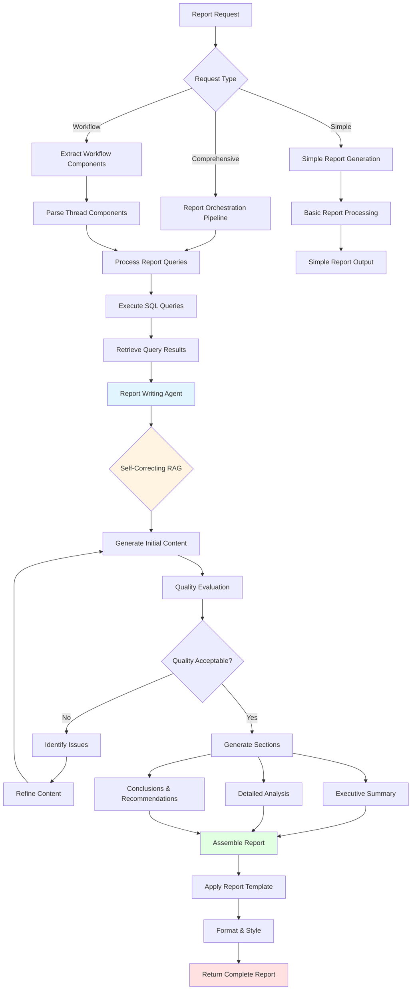
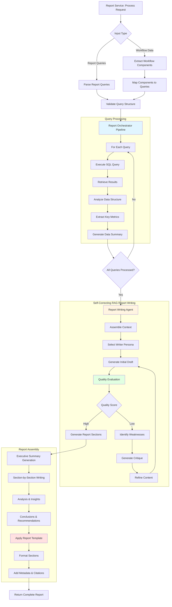
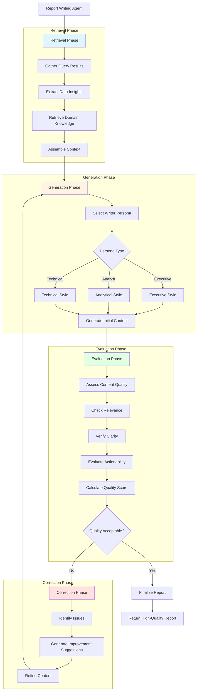
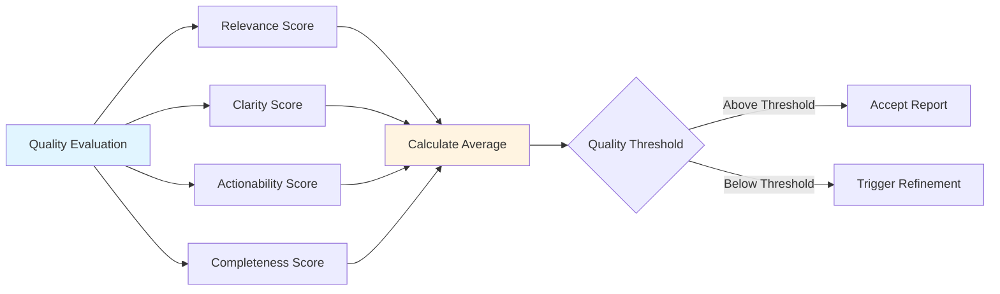
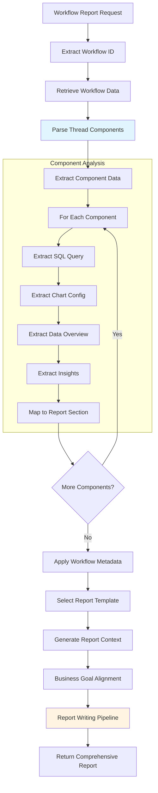
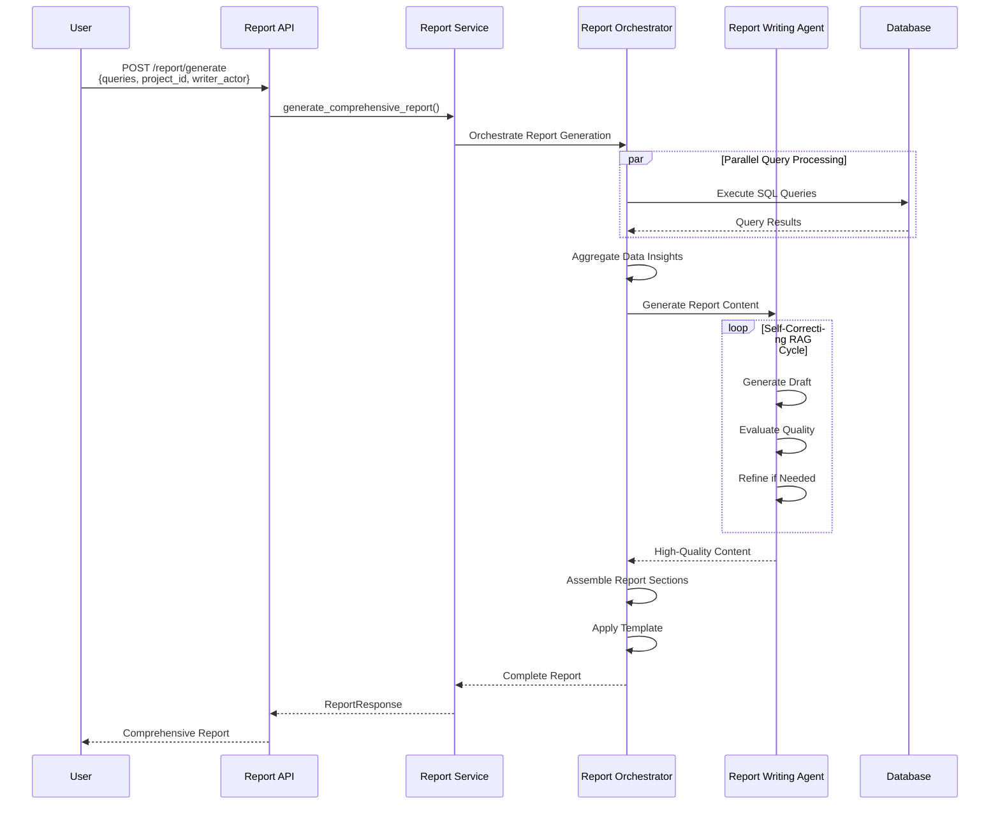
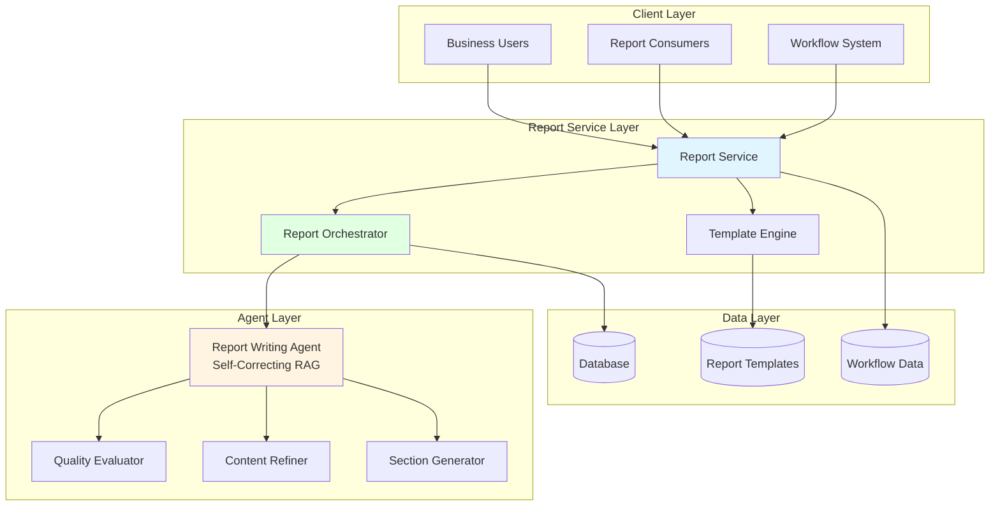
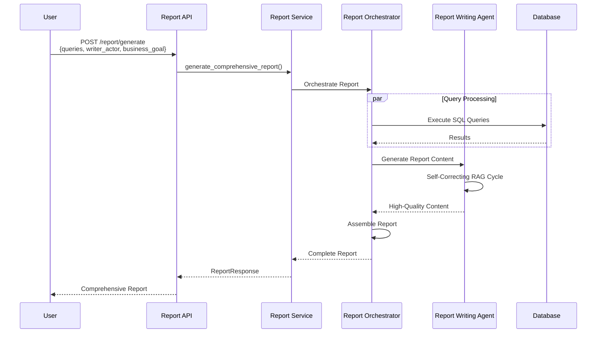
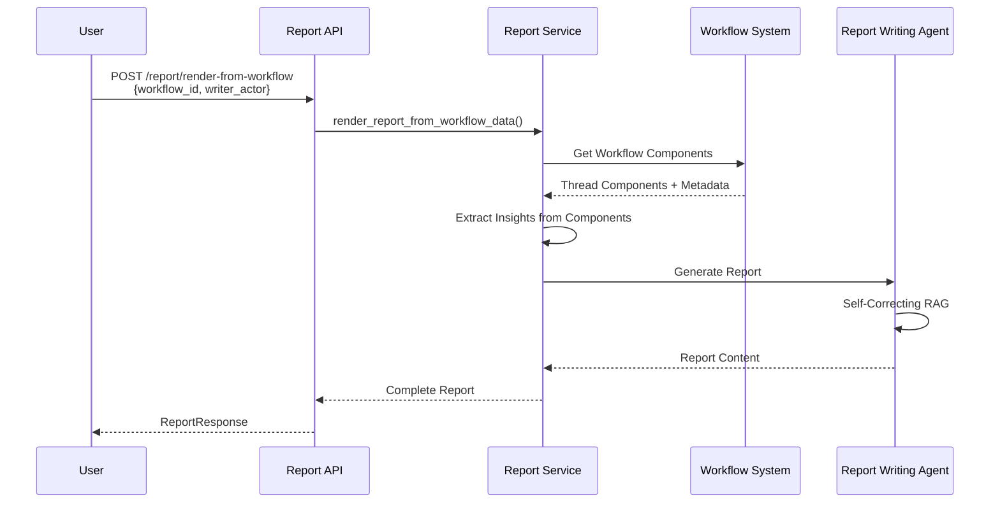

# Report Service Flow Diagrams

This document provides comprehensive flowcharts explaining how the Report Service works, enabling business users to generate comprehensive, AI-written reports from SQL queries in minutes.

## Purpose & Business Value

**Transform Data into Comprehensive Business Reports Instantly**

The Report Service enables business professionals to transform their SQL queries and data insights into professionally written, comprehensive reports with executive summaries, analysis, and conclusions. This capability delivers significant organizational value:

- **💰 Cost Savings**: Eliminates dependency on data analysts or report writers for report generation
- **⚡ Speed to Value**: Business users can generate comprehensive, publication-ready reports in **minutes** instead of spending hours writing and formatting
- **📝 AI-Powered Writing**: Leverages self-correcting RAG architecture to generate high-quality, contextually relevant report content
- **🎯 Multiple Writer Personas**: Supports different writing styles (Executive, Analyst, Technical) tailored to target audiences
- **🔄 Workflow Integration**: Automatically generates reports from workflow question threads
- **📊 Comprehensive Structure**: Produces reports with executive summaries, detailed analysis, conclusions, and actionable recommendations
- **🎨 Customizable Templates**: Pre-built templates for different report types and business goals

## Table of Contents

1. [Report Generation Flow](#report-generation-flow)
2. [Self-Correcting RAG Report Writing](#self-correcting-rag-report-writing)
3. [Workflow-Based Report Generation](#workflow-based-report-generation)
4. [Report Components & Architecture](#report-components--architecture)
5. [API Endpoints Reference](#api-endpoints-reference)

---

## Report Generation Flow

The Report Service processes SQL queries and generates comprehensive reports using AI-powered writing agents with self-correcting capabilities.

### High-Level Report Generation Flow

### Detailed Report Pipeline

---

## Self-Correcting RAG Report Writing

The Report Writing Agent uses a Self-Correcting RAG architecture to iteratively improve report quality through evaluation and refinement cycles.

### Self-Correcting RAG Report Flow

### Quality Evaluation Metrics

---

## Workflow-Based Report Generation

The Report Service can automatically generate reports from workflow data, extracting insights from question threads and creating comprehensive reports.

### Workflow Report Flow

### Report Orchestration Sequence

---

## Report Components & Architecture

### Component Architecture

---

## Key Components Summary

### Report Service Components

| Component | Purpose | Output |
|-----------|---------|--------|
| **Report Service** | Orchestrates report generation from queries or workflows | Complete report with all sections |
| **Report Orchestrator** | Coordinates query processing and report assembly | Aggregated data insights |
| **Report Writing Agent** | Self-correcting RAG agent that generates high-quality report content | Professionally written report sections |
| **Quality Evaluator** | Assesses content quality and relevance | Quality scores and improvement suggestions |
| **Content Refiner** | Iteratively improves report content based on evaluation | Refined, high-quality content |
| **Section Generator** | Creates structured report sections (executive summary, analysis, conclusions) | Formatted report sections |
| **Template Engine** | Applies report templates and formatting | Styled, publication-ready reports |

### Writer Personas

| Persona | Style | Use Case |
|---------|-------|----------|
| **Executive** | High-level, strategic, concise | C-suite reports, board presentations |
| **Analyst** | Detailed, data-driven, analytical | Deep-dive analysis, research reports |
| **Technical** | Precise, technical, comprehensive | Technical documentation, specifications |

### Report Templates

| Template | Sections | Target Audience |
|----------|----------|-----------------|
| **Executive Summary** | Overview, Key Findings, Recommendations | Executives, Decision Makers |
| **Comprehensive Analysis** | Full analysis with all sections | Analysts, Stakeholders |
| **Simple Report** | Basic overview and findings | General business users |

---

## API Endpoints Reference

### Report Generation

- `POST /report/generate` - Generate comprehensive report with AI writing
- `POST /report/generate-from-workflow` - Generate report from workflow data
- `POST /report/render-from-workflow` - Render report from workflow request
- `POST /report/generate-simple` - Generate simple report without comprehensive components

### Report Utilities

- `POST /report/conditional-formatting` - Generate conditional formatting for report data
- `POST /report/validate` - Validate report configuration
- `GET /report/templates` - Get available report templates
- `POST /report/templates/add` - Add custom report template
- `DELETE /report/templates/{template_name}` - Remove report template
- `GET /report/execution-history` - Get report execution history
- `GET /report/service-status` - Get service status
- `POST /report/clear-cache` - Clear report service cache

### Workflow Integration

- `GET /report/workflow/{workflow_id}/components` - Get workflow components
- `GET /report/workflow/{workflow_id}/status` - Get workflow status
- `POST /report/workflow/{workflow_id}/preview` - Preview workflow report

---

## Request/Response Examples

### Example 1: Comprehensive Report Generation

### Example 2: Workflow-Based Report

---

## Notes

- **Business Impact**: Enables business users to generate publication-ready reports in minutes, eliminating hours of manual writing and formatting
- **AI-Powered Writing**: Leverages Self-Correcting RAG architecture for high-quality, contextually relevant content
- **Multiple Personas**: Supports different writing styles for different target audiences
- **Quality Assurance**: Iterative improvement ensures reports meet quality standards
- **Workflow Integration**: Automatically transforms question threads into comprehensive reports
- **Template System**: Pre-built templates for common report types
- **Customizable**: Supports custom templates and business goal alignment
- **Comprehensive Structure**: Includes executive summaries, detailed analysis, and actionable recommendations

---

*Last Updated: [Current Date]*
*Version: 1.0*

