# Service Flow Diagrams

This document provides comprehensive flowcharts explaining how the Combined Ask Service and SQL Helper Service work, including the Safety Agent integrated into the SQL RAG Agent flow for governance.

## Purpose & Business Value

**Empower Business Users to Personalize Dashboards Independently**

Our platform enables business professionals to create, customize, and personalize dashboards using their own business intelligence tools—all through natural language queries. This self-service capability delivers significant value to organizations:

- **💰 Cost Savings**: Eliminates dependency on IT teams or expensive consultants for dashboard customization
- **⚡ Speed to Value**: Business users can create personalized dashboards in **minutes** instead of waiting days or weeks for IT requests
- **🎯 Self-Service Analytics**: Non-technical users can query data, generate visualizations, and build dashboards without SQL knowledge
- **🔒 Enterprise-Grade Governance**: Built-in safety controls ensure data access compliance and privacy protection
- **📊 Tool Agnostic**: Works seamlessly with any business intelligence tool, allowing organizations to leverage their existing investments

By combining natural language processing with Self-Correcting CRAG architecture, we transform complex SQL query generation into simple conversational interactions, putting the power of data analytics directly into the hands of business decision-makers.

## Table of Contents

1. [Combined Ask Service Flow](#combined-ask-service-flow)
2. [SQL Helper Service Flows](#sql-helper-service-flows)
3. [Integrated Service Architecture](#integrated-service-architecture)

---

## Combined Ask Service Flow

The Combined Ask Service processes user queries and provides both SQL results and intelligent question recommendations in a single request. This service combines the power of natural language to SQL conversion with proactive question suggestions.

**Business Impact**: Business users can ask questions in plain English like "Show me sales by region for Q4" and instantly receive SQL queries, visualizations, and dashboard configurations they can use in their own BI tools—all within minutes, eliminating the need for IT support.

### Self-Correcting CRAG Architecture

The **SQL RAG Agent** is built on a **Self-Correcting CRAG (Corrective Retrieval Augmented Generation)** architecture. This architecture enables the system to automatically detect, evaluate, and correct SQL queries through iterative improvement cycles.

**Key Principles of Self-Correcting CRAG:**

1. **Retrieval Phase**: Retrieves relevant database schema, table structures, and example queries from vector stores
2. **Generation Phase**: Generates SQL queries based on the retrieved context and user intent
3. **Evaluation Phase**: Validates the generated SQL for correctness, completeness, and performance
4. **Correction Phase**: Automatically corrects identified issues through iterative refinement
5. **Feedback Loop**: Learns from corrections to improve future query generation

This self-correcting capability ensures high-quality SQL generation by detecting errors early and continuously improving the output through multiple refinement cycles.

### Self-Correcting CRAG Flow Diagram

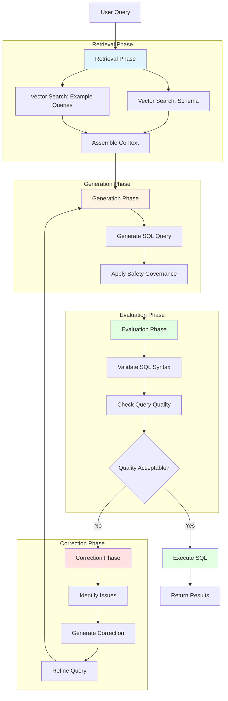

### High-Level Flow

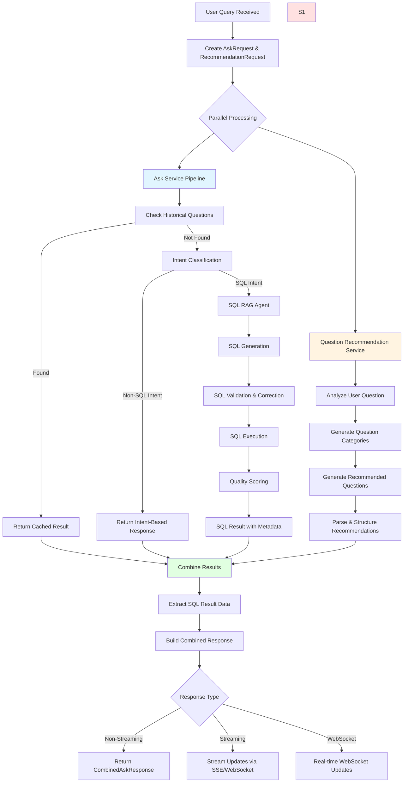

### Detailed Ask Service Pipeline with Self-Correcting CRAG

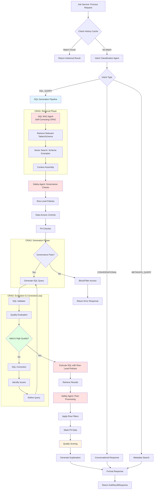

### Question Recommendation Service Flow

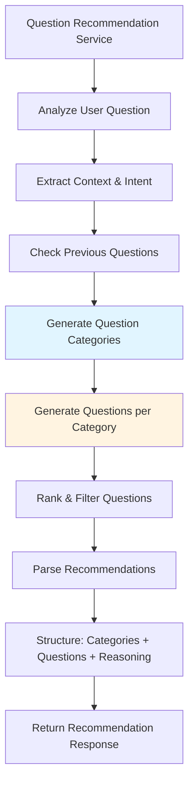

---

## SQL Helper Service Flows

The SQL Helper Service provides comprehensive assistance for SQL queries, including summarization, visualization, analysis, and data generation capabilities.

**Business Impact**: Enables business users to generate ready-to-use visualizations, summaries, and dashboard components from SQL queries—reducing the time from query to insight from hours to minutes. Users can instantly understand their data and create personalized dashboard views without technical expertise.

### SQL Summary & Visualization Flow

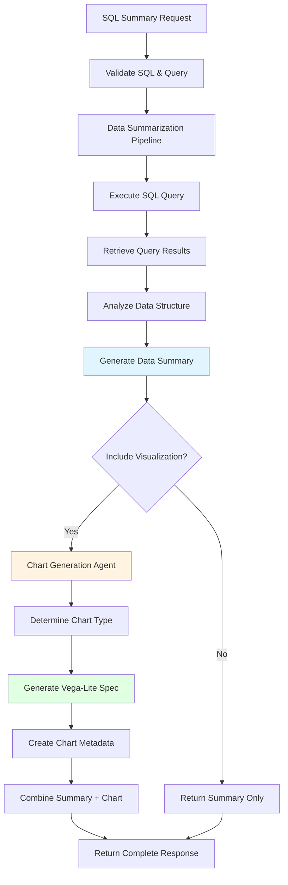

### Query Requirements Analysis Flow

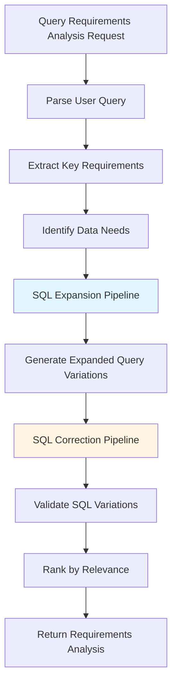

### SQL Visualization Generation Flow

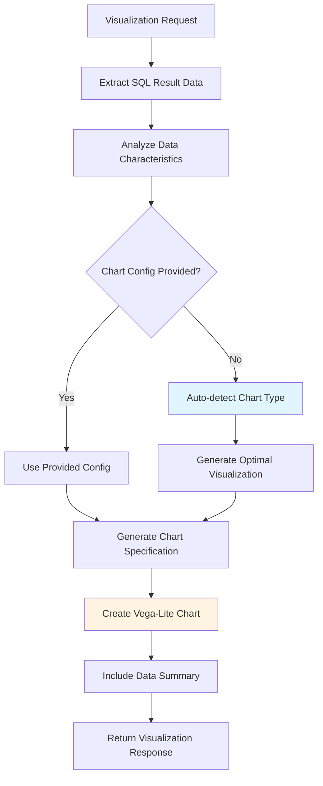

### Data Assistance Flow

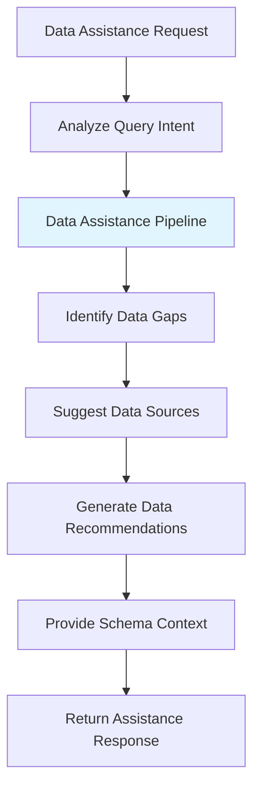

### SQL Expansion Flow

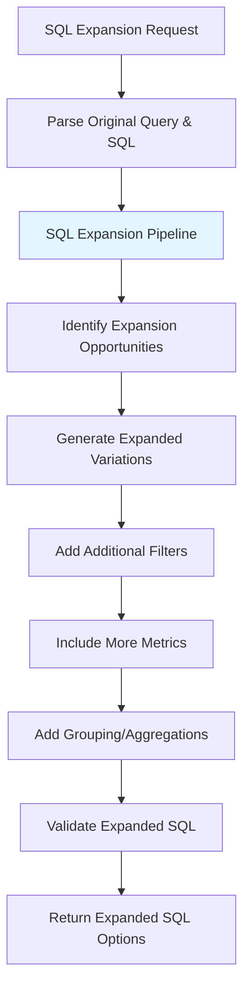

### Data Generation Flow

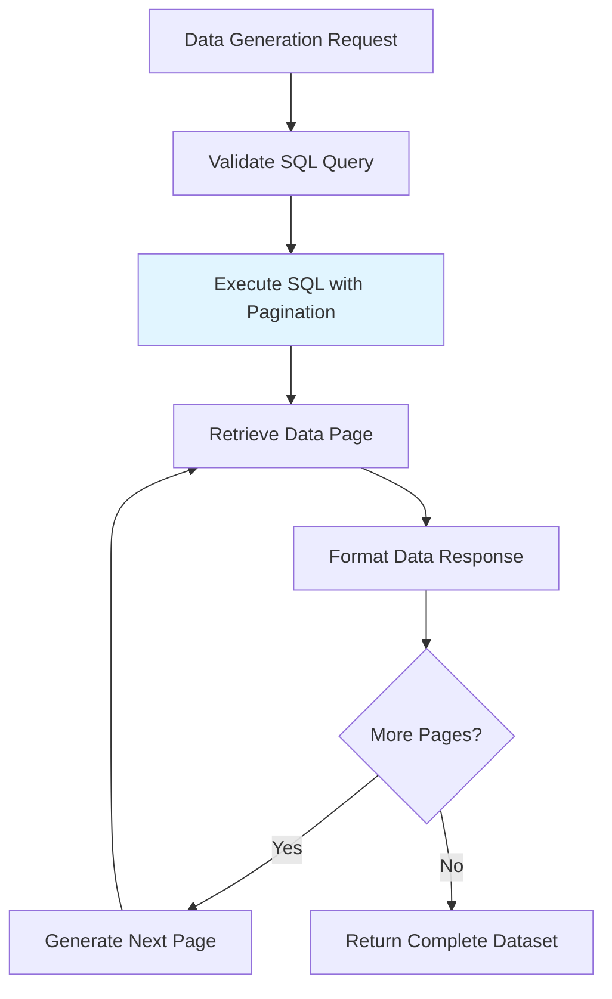

---

## Integrated Service Architecture

This diagram shows how the different services work together in the overall system architecture.

```mermaid
flowchart TB
    subgraph "Client Layer"
        C1[Web Application]
        C2[Mobile App]
        C3[API Clients]
    end
    
    subgraph "API Gateway"
        API1[/api/v1/combined]
        API2[/sql-helper/summary]
        API3[/sql-helper/visualization]
        API4[/sql-helper/analyze-requirements]
    end
    
    subgraph "Service Layer"
        SVC1[Ask Service]
        SVC2[Question Recommendation Service]
        SVC3[SQL Helper Service]
    end
    
    subgraph "Agent Layer"
        AG1[Intent Classification Agent]
        AG2[SQL RAG Agent<br/>Self-Correcting CRAG<br/>+ Safety Agent]
        AG3[SQL Generation Agent]
        AG4[Chart Generation Agent]
        AG5[Data Summarization Pipeline]
        AG6[SQL Expansion Pipeline]
        AG7[SQL Correction Pipeline]
    end
    
    subgraph "Data Layer"
        DB[(Database)]
        CACHE[(Cache Layer)]
        SCHEMA[(Schema Repository)]
    end
    
    C1 --> API1
    C2 --> API1
    C3 --> API1
    C1 --> API2
    C2 --> API3
    
    API1 --> SVC1
    API1 --> SVC2
    API2 --> SVC3
    API3 --> SVC3
    API4 --> SVC3
    
    SVC1 --> AG1
    SVC1 --> AG2
    SVC1 --> AG3
    SVC2 --> AG2
    SVC3 --> AG5
    SVC3 --> AG4
    SVC3 --> AG6
    SVC3 --> AG7
    
    AG1 --> CACHE
    AG2 --> SCHEMA
    AG2 --> CACHE
    AG3 --> DB
    AG5 --> DB
    AG6 --> SCHEMA
    AG7 --> DB
    
    style AG2 fill:#ffe1e1
    style API1 fill:#e1f5ff
    style SVC1 fill:#fff4e1
    style SVC2 fill:#fff4e1
    style SVC3 fill:#e1ffe1
```

---

## Request/Response Flow Examples

### Example 1: Complete Combined Ask Flow

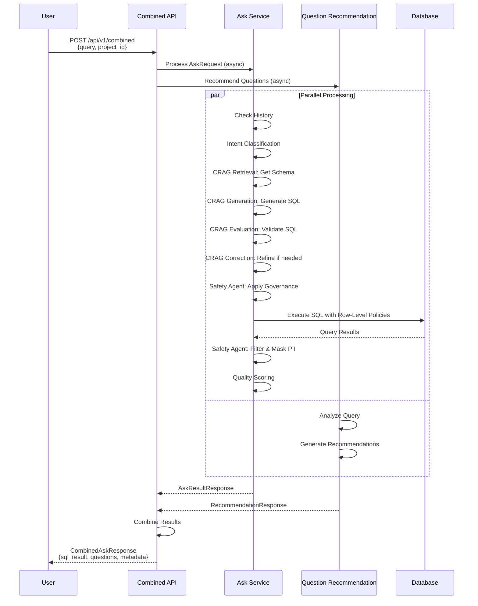

### Example 2: SQL Summary with Visualization

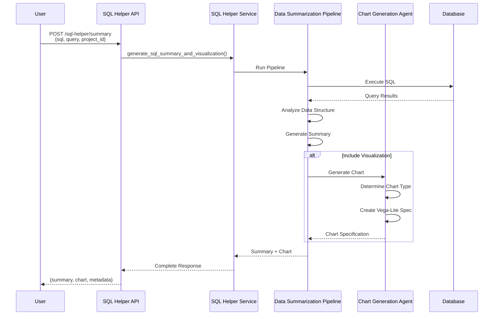

---

## Key Components Summary

### Combined Ask Service Components

| Component | Purpose | Output |
|-----------|---------|--------|
| **Ask Service** | Converts natural language to SQL and executes queries | SQL results, metadata, quality scores |
| **Question Recommendation** | Generates intelligent follow-up questions | Categorized question recommendations |
| **Intent Classification** | Determines query intent (SQL, conversational, metadata) | Intent type and appropriate response |
| **SQL RAG Agent** | Self-Correcting CRAG architecture: Retrieves relevant schema, generates SQL, evaluates, and auto-corrects queries iteratively | SQL query with reasoning, corrected and validated |
| **Safety Agent** | Enforces governance, row-level policies, data access controls, and PII checking | Governance-compliant SQL and filtered results |
| **Quality Scoring** | Evaluates SQL quality and correctness | Quality scores and metrics |

### SQL Helper Service Components

| Component | Purpose | Output |
|-----------|---------|--------|
| **Data Summarization Pipeline** | Analyzes SQL results and generates summaries | Data summaries with insights |
| **Chart Generation Agent** | Creates visualizations from SQL results | Vega-Lite chart specifications |
| **SQL Expansion Pipeline** | Generates expanded query variations | Multiple SQL query options |
| **SQL Correction Pipeline** | Validates and corrects SQL queries | Corrected and validated SQL |
| **Data Assistance Pipeline** | Provides guidance on data access and usage | Data recommendations and suggestions |

### Safety Agent Components (Integrated in SQL RAG Agent)

| Component | Purpose |
|-----------|---------|
| **Row Level Policies** | Enforces row-level security policies based on user context |
| **Data Access Controls** | Controls access to tables and columns based on user permissions |
| **PII Checker** | Detects and masks Personally Identifiable Information in queries and results |
| **Governance** | Ensures compliance with organizational policies and regulations |

---

## API Endpoints Reference

### Combined Ask Service

- `POST /api/v1/combined` - Process query and get recommendations (non-streaming)
- `POST /api/v1/combined/stream` - Process query with streaming updates (SSE)
- `WS /ws/combined?query_id={id}` - WebSocket endpoint for real-time updates

### SQL Helper Service

- `POST /sql-helper/summary` - Generate SQL summary and visualization
- `POST /sql-helper/summary/stream` - Stream SQL summary generation
- `POST /sql-helper/analyze-requirements` - Analyze query requirements
- `POST /sql-helper/visualization` - Generate visualization from SQL results
- `POST /sql-helper/data-assistance` - Get data access assistance
- `POST /sql-helper/sql-expansion` - Generate expanded SQL variations
- `POST /sql-helper/data-generation` - Generate paginated data results
- `GET /sql-helper/status/{query_id}` - Get query status
- `POST /sql-helper/stop/{query_id}` - Stop ongoing query

---

## Future Enhancements

1. **Enhanced Analytics**
   - Query performance optimization
   - Usage pattern analysis
   - Predictive query recommendations

3. **Advanced Visualizations**
   - Interactive chart generation
   - Multi-dimensional data visualization
   - Custom chart templates

4. **Collaboration Features**
   - Query sharing and collaboration
   - Saved query collections
   - Team-based access controls

---

## Notes

- All services support both synchronous and asynchronous (streaming) modes
- **SQL RAG Agent Architecture**: Built on Self-Correcting CRAG (Corrective Retrieval Augmented Generation), enabling automatic detection, evaluation, and correction of SQL queries through iterative refinement cycles
- **Safety Agent Integration**: The Safety Agent is integrated into the SQL RAG Agent flow, providing governance at the query and result level
- **Safety Agent Features**: Row Level Policies, Data Access Controls, PII Checker, and Governance
- **Self-Correcting Mechanism**: The CRAG architecture continuously improves SQL quality by:
  - Retrieving relevant schema and examples
  - Generating SQL queries
  - Evaluating correctness and quality
  - Automatically correcting identified issues
  - Iterating until high-quality SQL is produced
- Services are designed to be scalable and handle high concurrent loads
- All processing steps include comprehensive error handling and logging
- The system maintains audit trails for compliance and debugging purposes

---

*Last Updated: [Current Date]*
*Version: 1.0*

