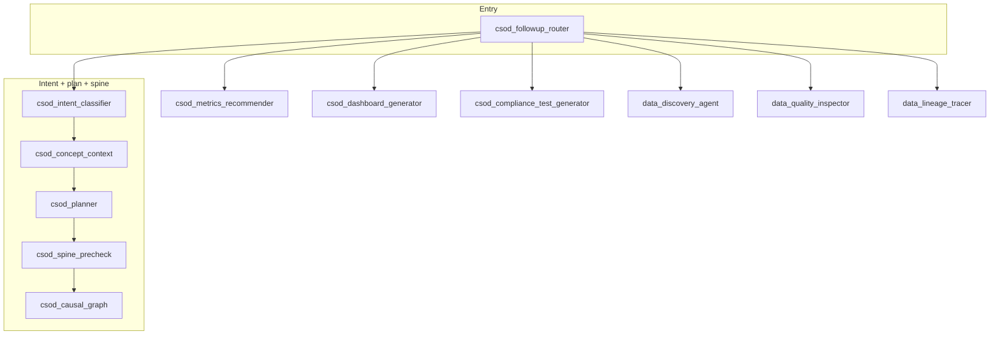
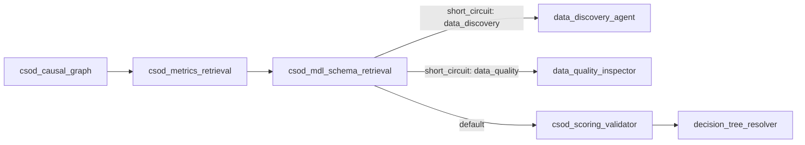
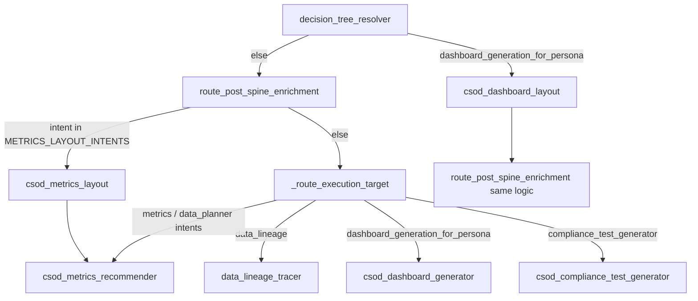

# CSOD main graph: data flow and agent interactions

This document describes the **data flow** and **agent interaction flow** for the CSOD LangGraph, grounded in:

- `complianceskill/app/agents/csod/workflows/csod_main_graph.py`
- `complianceskill/app/agents/csod/workflows/csod_main_routing.py`

---

## 1. High-level agent interaction flow

**Entry:** `csod_followup_router` reads `csod_followup_graph_route` and either jumps mid-graph (follow-up) or starts the main pipeline at `csod_intent_classifier`.

**After causal graph (fixed chain):** `csod_causal_graph` → `csod_metrics_retrieval` → `csod_mdl_schema_retrieval` → then routing chooses scoring vs data agents.

**Post–decision-tree (intent-driven):** `route_after_dt_resolver` sends `dashboard_generation_for_persona` to `csod_dashboard_layout`; everyone else goes through `route_post_spine_enrichment` (metrics layout vs execution target).

**“Deep” metrics path (typical recommender):** `csod_metrics_recommender` → (unless `data_planner` → `data_pipeline_planner`) → `csod_data_science_insights_enricher` → optional `calculation_planner` → optional `csod_medallion_planner` → optional `csod_gold_model_sql_generator` → optional `cubejs_schema_generation` → `csod_scheduler` → `csod_output_assembler` → `END`. Short-circuit flag `csod_followup_short_circuit` can send straight to `csod_output_assembler` from several nodes.

---

## 2. Data flow (state and artifacts)

Roughly in pipeline order:

| Stage | Nodes | Typical state / artifacts |
|--------|--------|----------------------------|
| Routing | `csod_followup_router` | `csod_followup_graph_route`, optional bypass to later agents |
| Intent | `csod_intent_classifier` | `csod_intent`, classifier messages |
| Concepts | `csod_concept_context` | Concept / domain context bound to the query (feeds planner and retrieval) |
| Plan | `csod_planner` | Planner output, structured next steps |
| Spine | `csod_spine_precheck` | Spine / guardrails before CCE |
| Causal | `csod_causal_graph` | Causal context for metrics and narration |
| Metrics fetch | `csod_metrics_retrieval` | Retrieved metric candidates / evidence |
| MDL | `csod_mdl_schema_retrieval` | Schema / table refs; may short-circuit to discovery or quality agents |
| Score | `csod_scoring_validator` | Validated / scored candidates |
| DT | `decision_tree_resolver` | Branch choice that drives layout vs direct execution |
| Layout | `csod_dashboard_layout` / `csod_metrics_layout` | Layout plans before generation / recommender |
| Recommend | `csod_metrics_recommender` | `csod_metric_recommendations`, follow-up short-circuit |
| Enrich | `csod_data_science_insights_enricher` | `csod_data_science_insights` |
| Plan SQL / gold | `calculation_planner` → `csod_medallion_planner` → `csod_gold_model_sql_generator` | `csod_medallion_plan`, `csod_generated_gold_model_sql` |
| Cube | `cubejs_schema_generation` | Cube artifacts when gold SQL exists |
| Schedule / assemble | `csod_scheduler` → `csod_output_assembler` | Final unified response |

Data-discovery and data-quality paths skip the DT tail and land on `csod_output_assembler` after their agent node.

---

## 3. Example: “Recommend KPIs for our learning completion program”

Assume a **new** turn (follow-up router sends you to `csod_intent_classifier`), and the classifier sets something like `metric_kpi_advisor` or `metrics_recommender_with_gold_plan` (both are in `METRICS_LAYOUT_INTENTS` in `csod_main_routing.py` for layout routing).

1. **`csod_followup_router`** → `csod_intent_classifier` (default route).
2. **`csod_intent_classifier`** → sets `csod_intent` to a metrics-style intent.
3. **`csod_concept_context`** → attaches “learning / completion” style concept context from the user text.
4. **`csod_planner`** → produces a plan aligned with that intent and context.
5. **`route_after_planner`** → always **`csod_spine_precheck`**.
6. **`route_after_spine_precheck`** → **`csod_causal_graph`** (CCE runs for narrative and metric grounding).
7. **`csod_metrics_retrieval`** → pulls relevant metrics from the catalog / retrieval layer.
8. **`csod_mdl_schema_retrieval`** → loads MDL/schema context; unless intent is pure `data_discovery` / `data_quality_analysis` with short-circuit, continues to scoring.
9. **`csod_scoring_validator`** → **`decision_tree_resolver`**.
10. **`route_after_dt_resolver`** → not `dashboard_generation_for_persona`, so **`route_post_spine_enrichment`**.
11. Because intent is in **`METRICS_LAYOUT_INTENTS`** → **`csod_metrics_layout`** → **`csod_metrics_recommender`**.
12. Unless `csod_followup_short_circuit` or `data_planner` branch → **`csod_data_science_insights_enricher`**.
13. If there are recommendations or insights → **`calculation_planner`**; if gold plan is needed → **`csod_medallion_planner`** → possibly **`csod_gold_model_sql_generator`** → **`cubejs_schema_generation`**.
14. **`csod_scheduler`** → **`csod_output_assembler`** → graph ends with the packaged answer (KPI list, rationale, optional SQL/Cube path).

If the same user later says “add a chart for that,” **`csod_followup_router`** might set `csod_followup_graph_route` to **`csod_metrics_recommender`** or **`csod_dashboard_generator`**, skipping intent → concept → planner → spine for that turn, which is why the router is drawn as a hub in the first diagram.

---

## 4. Summary

The **graph** is the sequence of nodes in `csod_main_graph.py`; the **branching** is almost entirely in `csod_main_routing.py` (`route_after_*`, `route_post_spine_enrichment`, `_route_execution_target`, and `METRICS_LAYOUT_INTENTS`). The **example** walks the default “new question” path through intent → concept → planner → spine → causal → metrics → MDL → DT → (metrics layout) → recommender → enrich → optional gold/Cube → scheduler → assembler.
