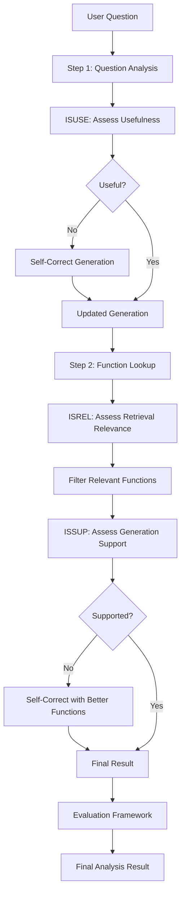

# Self-RAG Enhanced Analysis Intent Classification

This implementation incorporates Self-RAG (Self-Reflective Retrieval-Augmented Generation) patterns into the analysis intent classification system, providing self-reflection and self-correction capabilities without using stateful graphs.

## Overview

The Self-RAG approach enhances the analysis intent classification by:

1. **Self-Reflection on Retrieval Quality (ISREL Token)**: Assesses whether retrieved functions are relevant to the question
2. **Self-Reflection on Generation Quality (ISSUP Token)**: Evaluates if the generated analysis plan is supported by available functions
3. **Self-Reflection on Usefulness (ISUSE Token)**: Determines if the generation is useful for answering the question
4. **Self-Correction**: Automatically improves poor quality outputs based on assessment results
5. **Evaluation Framework**: Provides quality assessment with pass-through capability for future enhancements

## Key Components

### 1. SelfRAGAnalysisIntentPlanner

The main class that orchestrates the self-RAG enhanced analysis process.

```python
from analysis_intent_classification_self_rag import SelfRAGAnalysisIntentPlanner

planner = SelfRAGAnalysisIntentPlanner(
    llm=llm,
    retrieval_helper=retrieval_helper,
    max_retries=3
)
```

### 2. Self-Reflection Methods

#### Retrieval Relevance Assessment (`_assess_retrieval_relevance`)
- **Purpose**: ISREL token - evaluates if retrieved functions are relevant
- **Input**: Question, retrieved functions, step context
- **Output**: Relevance assessment with filtered functions

#### Generation Support Assessment (`_assess_generation_support`)
- **Purpose**: ISSUP token - checks if generation is supported by functions
- **Input**: Question, generation, supporting functions
- **Output**: Support assessment with unsupported statements

#### Generation Usefulness Assessment (`_assess_generation_usefulness`)
- **Purpose**: ISUSE token - evaluates if generation is useful
- **Input**: Question, generation
- **Output**: Usefulness assessment with improvement suggestions

### 3. Self-Correction Method

#### Self-Correction (`_self_correct_generation`)
- **Purpose**: Improves generation based on assessment results
- **Input**: Question, original generation, assessment results, available functions
- **Output**: Corrected generation with improvement summary

### 4. Evaluation Framework

#### Analysis Quality Evaluation (`_evaluate_analysis_quality`)
- **Purpose**: Overall quality assessment (currently pass-through)
- **Input**: Question, final result, assessment history
- **Output**: Quality metrics and evaluation notes

## Usage Example

```python
import asyncio
from langchain_openai import ChatOpenAI
from analysis_intent_classification_self_rag import SelfRAGAnalysisIntentPlanner

async def main():
    # Initialize components
    llm = ChatOpenAI(model="gpt-4o-mini", temperature=0.1)
    retrieval_helper = YourRetrievalHelper()  # Your actual retrieval helper
    
    planner = SelfRAGAnalysisIntentPlanner(
        llm=llm,
        retrieval_helper=retrieval_helper,
        max_retries=3
    )
    
    # Run analysis with self-RAG
    result = await planner.classify_intent_with_self_rag(
        question="How does the 5-day rolling variance of flux change over time?",
        dataframe_description="Financial transaction data",
        dataframe_summary="Contains 100k+ transactions with time series metrics",
        available_columns=["date", "flux", "group", "revenue"]
    )
    
    # Access results
    print(f"Intent: {result['intent_type']}")
    print(f"Confidence: {result['confidence_score']}")
    print(f"Corrections Applied: {result['self_rag_metadata']['corrections_applied']}")

# Run the example
asyncio.run(main())
```

## Self-RAG Flow



## Key Features

### 1. Quality Assessment Tokens

- **ISREL**: "Is Relevant" - assesses retrieval quality
- **ISSUP**: "Is Supported" - evaluates generation support
- **ISUSE**: "Is Useful" - determines generation usefulness

### 2. Self-Correction Mechanisms

- Automatic correction of poor quality retrievals
- Improvement of generation based on assessment feedback
- Confidence score adjustments based on corrections

### 3. Assessment History

- Tracks all assessments made during the process
- Records which corrections were applied
- Provides metadata for debugging and improvement

### 4. Evaluation Framework

- Currently implemented as pass-through
- Ready for future enhancement with sophisticated evaluation metrics
- Provides quality scores and assessment counts

## Configuration Options

### Max Retries
```python
planner = SelfRAGAnalysisIntentPlanner(
    llm=llm,
    retrieval_helper=retrieval_helper,
    max_retries=3  # Maximum number of correction attempts
)
```

### Retrieval Helper
The retrieval helper should implement:
```python
async def get_function_definition_by_query(
    self, 
    query: str, 
    similarity_threshold: float = 0.3, 
    top_k: int = 5
) -> Dict[str, Any]:
    # Return function definitions matching the query
    pass
```

## Output Structure

The self-RAG enhanced analysis returns:

```python
{
    # Standard analysis results
    "rephrased_question": "...",
    "intent_type": "time_series_analysis",
    "confidence_score": 0.85,
    "reasoning_plan": [...],
    "suggested_functions": [...],
    
    # Self-RAG metadata
    "self_rag_metadata": {
        "step1_metadata": {
            "usefulness_assessment": {...},
            "correction_applied": True,
            "confidence_improvement": 0.1
        },
        "step2_metadata": {
            "retrieval_assessments": [...],
            "total_assessments": 3,
            "corrections_applied": 1
        },
        "total_assessments": 4,
        "corrections_applied": 2
    },
    
    # Evaluation results
    "evaluation": {
        "overall_quality": "good",
        "confidence_score": 0.85,
        "assessment_count": 4,
        "self_corrections_applied": 2
    }
}
```

## Benefits

1. **Improved Quality**: Self-reflection ensures higher quality analysis plans
2. **Self-Correction**: Automatic improvement of poor outputs
3. **Transparency**: Detailed assessment history and metadata
4. **Flexibility**: Easy to extend with additional assessment criteria
5. **No Stateful Graphs**: Simple, maintainable implementation without complex graph state management

## Future Enhancements

1. **Advanced Evaluation**: Implement sophisticated quality metrics
2. **Multi-Modal Assessment**: Support for different types of analysis
3. **Learning from Corrections**: Improve future performance based on correction patterns
4. **Custom Assessment Criteria**: Allow configuration of assessment parameters
5. **Integration with CRAG**: Combine with Corrective RAG patterns for enhanced retrieval

## Testing

Run the example to see self-RAG in action:

```bash
python self_rag_example.py
```

This will demonstrate:
- Self-RAG enhanced analysis for various question types
- Self-correction capabilities
- Assessment history and metadata
- Evaluation framework output
