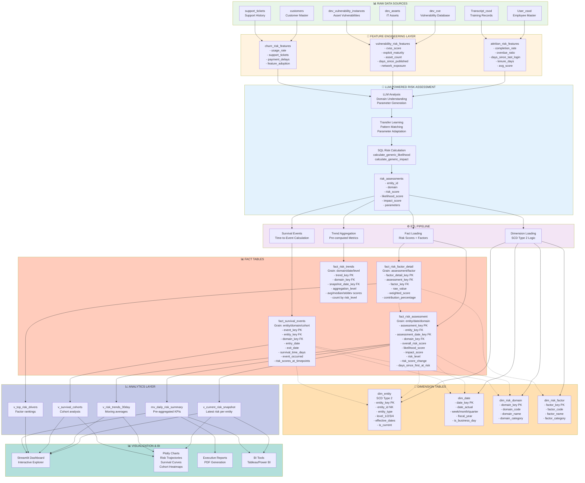
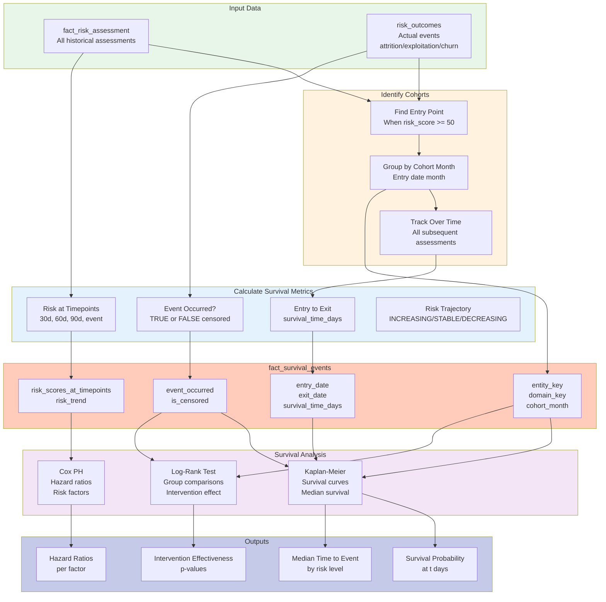
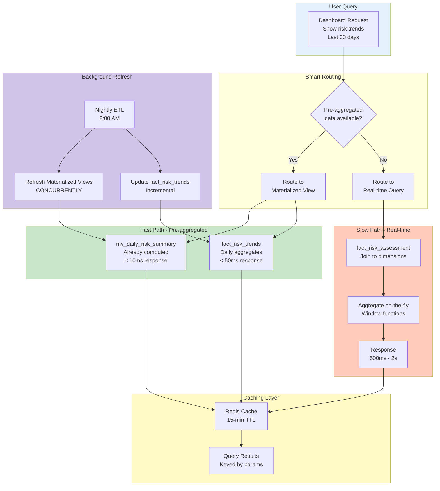
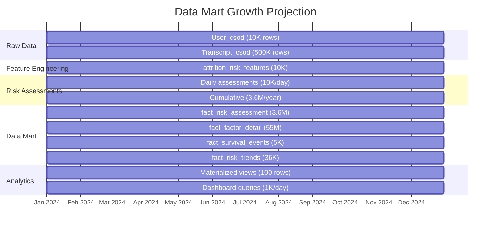

# Risk Analytics Data Mart - Data Flow Diagrams

## Complete Visual Guide to Data Architecture

---

## Diagram 1: End-to-End Data Flow



---

## Diagram 2: Data Mart Star Schema (Detailed)

```mermaid
erDiagram
    dim_entity ||--o{ fact_risk_assessment : "entity_key"
    dim_date ||--o{ fact_risk_assessment : "assessment_date_key"
    dim_risk_domain ||--o{ fact_risk_assessment : "domain_key"
    fact_risk_assessment ||--o{ fact_risk_factor_detail : "assessment_key"
    dim_risk_factor ||--o{ fact_risk_factor_detail : "factor_key"
    dim_entity ||--o{ fact_survival_events : "entity_key"
    dim_date ||--o{ fact_survival_events : "event_date_key"
    dim_risk_domain ||--o{ fact_survival_events : "domain_key"
    dim_risk_domain ||--o{ fact_risk_trends : "domain_key"
    dim_date ||--o{ fact_risk_trends : "snapshot_date_key"

    dim_entity {
        integer entity_key PK
        varchar entity_id NK
        varchar entity_name
        varchar entity_type
        varchar level_1
        varchar level_2
        varchar level_3
        varchar level_4
        varchar business_criticality
        date effective_start_date
        date effective_end_date
        boolean is_current
    }

    dim_date {
        integer date_key PK
        date date_actual UK
        integer day_of_week
        varchar day_name
        integer week_of_year
        integer month_number
        varchar month_name
        integer quarter_number
        integer year_number
        integer fiscal_year
        boolean is_business_day
        boolean is_month_end
    }

    dim_risk_domain {
        integer domain_key PK
        varchar domain_code UK
        varchar domain_name
        varchar domain_category
        varchar risk_framework
    }

    dim_risk_factor {
        integer factor_key PK
        varchar factor_code UK
        varchar factor_name
        varchar factor_category
        varchar data_source
    }

    fact_risk_assessment {
        bigint assessment_key PK
        integer entity_key FK
        integer assessment_date_key FK
        integer domain_key FK
        decimal overall_risk_score
        decimal likelihood_score
        decimal impact_score
        varchar risk_level
        integer risk_level_numeric
        decimal risk_score_change
        varchar risk_level_change
        integer days_since_last_assessment
        integer days_since_first_at_risk
        boolean is_censored
        decimal transfer_confidence
        timestamp assessed_at
    }

    fact_risk_factor_detail {
        bigint factor_detail_key PK
        bigint assessment_key FK
        integer factor_key FK
        decimal raw_value
        decimal normalized_value
        decimal decayed_value
        decimal weighted_score
        decimal weight_applied
        varchar decay_function
        decimal contribution_percentage
        boolean is_primary_driver
    }

    fact_survival_events {
        bigint event_key PK
        integer entity_key FK
        integer event_date_key FK
        integer domain_key FK
        varchar event_type
        boolean event_occurred
        date entry_date
        date exit_date
        integer survival_time_days
        decimal risk_score_at_entry
        decimal risk_score_at_30_days
        decimal risk_score_at_60_days
        decimal risk_score_at_90_days
        decimal risk_score_at_event
        varchar risk_trend
        decimal peak_risk_score
        date cohort_month
    }

    fact_risk_trends {
        bigint trend_key PK
        integer domain_key FK
        integer snapshot_date_key FK
        varchar aggregation_level
        varchar entity_type
        integer total_entities
        decimal avg_risk_score
        decimal median_risk_score
        decimal stddev_risk_score
        integer count_critical
        integer count_high
        integer count_medium
        integer count_low
        decimal avg_risk_change
    }
```

---

## Diagram 3: Risk Assessment Data Flow (Detailed)

```mermaid
flowchart LR
    subgraph SOURCE["Source Data"]
        S1[(User_csod<br/>10,000 rows)]
        S2[(Transcript_csod<br/>500,000 rows)]
    end

    subgraph FEATURE["Feature Engineering"]
        F1[SQL Transformation<br/>Aggregate by user]
        F2[attrition_risk_features<br/>10,000 rows<br/>15 columns]
    end

    subgraph ASSESS["Risk Assessment"]
        A1[LLM Analysis<br/>Natural Language Spec]
        A2[Transfer Learning<br/>Find Similar Patterns]
        A3[Parameter Adaptation<br/>Adjust Weights]
        A4[SQL Calculation<br/>calculate_generic_*]
        A5[risk_assessments<br/>10,000 rows<br/>Daily]
    end

    subgraph DIM_LOAD["Dimension Loading"]
        D1[Lookup/Create Entity<br/>SCD Type 2]
        D2[Generate Date Keys<br/>YYYYMMDD format]
        D3[Lookup Domain<br/>Static ref data]
    end

    subgraph FACT_LOAD["Fact Loading"]
        FL1[Join to Dimensions<br/>Get surrogate keys]
        FL2[Calculate Changes<br/>vs previous assessment]
        FL3[Insert Facts<br/>Atomic operation]
    end

    subgraph MART["Data Mart"]
        M1[(fact_risk_assessment<br/>10,000 rows/day<br/>3.6M rows/year)]
        M2[(fact_risk_factor_detail<br/>150,000 rows/day<br/>55M rows/year)]
        M3[(fact_survival_events<br/>5,000 cohort entries)]
    end

    S1 --> F1
    S2 --> F1
    F1 --> F2
    F2 --> A1
    A1 --> A2
    A2 --> A3
    A3 --> A4
    A4 --> A5
    A5 --> D1
    A5 --> D2
    A5 --> D3
    D1 --> FL1
    D2 --> FL1
    D3 --> FL1
    A5 --> FL2
    FL1 --> FL3
    FL2 --> FL3
    FL3 --> M1
    M1 --> M2
    M1 --> M3

    style SOURCE fill:#e8f5e9
    style FEATURE fill:#fff3e0
    style ASSESS fill:#e3f2fd
    style DIM_LOAD fill:#ffe0b2
    style FACT_LOAD fill:#f3e5f5
    style MART fill:#ffccbc
```



---

## Diagram 4: Survival Analysis Data Flow



---

## Diagram 5: Query Performance Optimization



---

## Diagram 6: Data Volume & Growth



---

## Diagram 7: Example - Employee Attrition Flow

```
┌─────────────────────────────────────────────────────────────────────┐
│ SOURCE: User_csod + Transcript_csod                                 │
│ ─────────────────────────────────────────────────────────────────── │
│ User: USR12345 (John Smith, Senior Engineer)                       │
│ - Last Login: 2025-12-20 (47 days ago)                            │
│ - Tenure: 6.2 years                                                 │
│ - Training Records: 127 assignments                                 │
│   • Completed: 44 (35%)                                            │
│   • Overdue: 53 (42%)                                              │
│   • Average Score: 78%                                             │
└─────────────────────────────────────────────────────────────────────┘
                                    │
                                    ▼
┌─────────────────────────────────────────────────────────────────────┐
│ FEATURE ENGINEERING: attrition_risk_features                        │
│ ─────────────────────────────────────────────────────────────────── │
│ userId: USR12345                                                    │
│ - completion_rate: 35.0                                             │
│ - overdue_ratio: 42.0                                               │
│ - days_since_last_login: 47                                         │
│ - tenure_days: 2,263                                                │
│ - avg_score: 78.0                                                   │
│ - recent_completions: 2 (last 30 days)                             │
└─────────────────────────────────────────────────────────────────────┘
                                    │
                                    ▼
┌─────────────────────────────────────────────────────────────────────┐
│ LLM RISK ASSESSMENT                                                 │
│ ─────────────────────────────────────────────────────────────────── │
│ Analysis: High attrition risk detected                              │
│ Transfer Learning: Used "customer_churn" patterns (similarity: 0.84)│
│                                                                      │
│ LIKELIHOOD (72.1):                                                  │
│   • completion_rate (35.0) × 0.38 = 28.4 (inverted)               │
│   • overdue_ratio (42.0) × 0.27 = 11.3                            │
│   • login_recency (47 days) × 0.22 × decay = 15.8                 │
│                                                                      │
│ IMPACT (64.8):                                                      │
│   • tenure (2,263 days) × 0.32 = 19.8                             │
│   • position_criticality (80) × 0.28 = 22.4                       │
│   • team_size (3) × 0.25 × 1.5 cascade = 2.3                      │
│                                                                      │
│ OVERALL RISK: √(72.1 × 64.8) = 68.4                               │
└─────────────────────────────────────────────────────────────────────┘
                                    │
                                    ▼
┌─────────────────────────────────────────────────────────────────────┐
│ risk_assessments TABLE                                              │
│ ─────────────────────────────────────────────────────────────────── │
│ INSERT: assessment_id = 123456                                      │
│         entity_id = USR12345                                        │
│         domain = hr_attrition                                       │
│         predicted_risk = 68.4                                       │
│         predicted_likelihood = 72.1                                 │
│         predicted_impact = 64.8                                     │
│         risk_level = HIGH                                           │
└─────────────────────────────────────────────────────────────────────┘
                                    │
                                    ▼
┌─────────────────────────────────────────────────────────────────────┐
│ ETL TO DATA MART                                                    │
│ ─────────────────────────────────────────────────────────────────── │
│ 1. dim_entity lookup → entity_key = 7891                           │
│ 2. dim_date lookup → date_key = 20260105                           │
│ 3. dim_risk_domain lookup → domain_key = 1                         │
│                                                                      │
│ INSERT fact_risk_assessment:                                        │
│   assessment_key = 456789                                           │
│   entity_key = 7891                                                 │
│   assessment_date_key = 20260105                                    │
│   domain_key = 1                                                    │
│   overall_risk_score = 68.4                                         │
│   likelihood_score = 72.1                                           │
│   impact_score = 64.8                                               │
│   risk_level = HIGH                                                 │
│   risk_score_change = +4.2 (from yesterday)                        │
│   days_since_first_at_risk = 87                                    │
│                                                                      │
│ INSERT fact_risk_factor_detail (4 rows):                           │
│   1. completion_rate: raw=35.0, weighted=28.4, contrib=39.4%       │
│   2. overdue_ratio: raw=42.0, weighted=11.3, contrib=15.7%         │
│   3. login_recency: raw=47, weighted=15.8, contrib=21.9%           │
│   4. tenure: raw=2263, weighted=19.8, contrib=23.0%                │
│                                                                      │
│ INSERT/UPDATE fact_survival_events:                                │
│   entity_key = 7891                                                 │
│   entry_date = 2025-10-10 (when risk first >= 50)                 │
│   survival_time_days = 87                                          │
│   event_occurred = FALSE (still employed, censored)                │
│   risk_score_at_entry = 52.1                                       │
│   risk_score_at_30_days = 58.3                                     │
│   risk_score_at_60_days = 63.7                                     │
│   risk_score_at_event = 68.4 (current)                            │
│   risk_trend = INCREASING                                           │
│   cohort_month = 2025-10-01                                        │
└─────────────────────────────────────────────────────────────────────┘
                                    │
                                    ▼
┌─────────────────────────────────────────────────────────────────────┐
│ ANALYTICS & VISUALIZATION                                           │
│ ─────────────────────────────────────────────────────────────────── │
│ Query: v_current_risk_snapshot                                      │
│ Result: USR12345 appears in HIGH risk category                     │
│                                                                      │
│ Query: v_top_risk_drivers                                           │
│ Result: "completion_rate" is #1 driver (39.4% contribution)        │
│                                                                      │
│ Query: Survival Analysis                                            │
│ Result: With current trajectory, predicted attrition in ~45 days   │
│         (Median survival for HIGH risk cohort)                      │
│                                                                      │
│ Dashboard Alert: 🔴 CRITICAL - USR12345 requires intervention      │
│ Recommendations:                                                     │
│   1. Schedule 1-on-1 within 48 hours                               │
│   2. Review training barriers                                       │
│   3. Manager engagement required                                    │
└─────────────────────────────────────────────────────────────────────┘
```

---

## Table Sizes & Performance Benchmarks

| Table | Grain | Rows (1 year) | Size | Query Time |
|-------|-------|---------------|------|------------|
| **dim_entity** | One per unique entity | 10,000 | 5 MB | <5ms |
| **dim_date** | One per day (10 years) | 3,650 | 1 MB | <1ms |
| **dim_risk_domain** | One per domain | 10 | <1 MB | <1ms |
| **dim_risk_factor** | One per factor | 100 | <1 MB | <1ms |
| **fact_risk_assessment** | entity × date × domain | 3.6M | 500 MB | 50-200ms |
| **fact_risk_factor_detail** | assessment × factor | 55M | 5 GB | 100-500ms |
| **fact_survival_events** | entity × domain × cohort | 10,000 | 10 MB | 10-50ms |
| **fact_risk_trends** | domain × date × level | 36,000 | 20 MB | <10ms |
| **Materialized Views** | Pre-aggregated | 1,000 | 1 MB | <5ms |

### Index Strategy

```sql
-- Primary Keys (B-tree)
CREATE INDEX idx_fact_risk_assessment_pk ON fact_risk_assessment(assessment_key);

-- Foreign Keys (B-tree)
CREATE INDEX idx_fact_risk_assessment_entity ON fact_risk_assessment(entity_key);
CREATE INDEX idx_fact_risk_assessment_date ON fact_risk_assessment(assessment_date_key);
CREATE INDEX idx_fact_risk_assessment_domain ON fact_risk_assessment(domain_key);

-- Query Optimization (Composite)
CREATE INDEX idx_fact_risk_assessment_entity_date ON fact_risk_assessment(entity_key, assessment_date_key);
CREATE INDEX idx_fact_risk_assessment_domain_date ON fact_risk_assessment(domain_key, assessment_date_key);

-- Filter Optimization (Partial)
CREATE INDEX idx_fact_risk_assessment_high_risk ON fact_risk_assessment(risk_level, overall_risk_score)
WHERE risk_level IN ('CRITICAL', 'HIGH');

-- Survival Analysis (Composite)
CREATE INDEX idx_fact_survival_events_cohort ON fact_survival_events(cohort_month, domain_key, event_occurred);
```

---

## Data Lineage Example

```
User_csod.userId = 'USR12345'
    ↓
attrition_risk_features.userId = 'USR12345'
    ↓
risk_assessments.entity_id = 'USR12345'
    ↓
dim_entity.entity_id = 'USR12345' → entity_key = 7891
    ↓
fact_risk_assessment.entity_key = 7891
    ↓
v_current_risk_snapshot.entity_id = 'USR12345'
    ↓
Dashboard: "John Smith (USR12345) - Risk: 68.4 - Level: HIGH"
```

---

## Summary

This comprehensive set of diagrams shows:

1. **End-to-End Flow**: From raw sources through LLM assessment to data marts to visualizations
2. **Star Schema**: Detailed entity-relationship diagram of the dimensional model
3. **Risk Assessment Flow**: Step-by-step transformation with row counts
4. **Survival Analysis Flow**: How time-to-event data is computed
5. **Query Optimization**: Performance paths and caching strategy
6. **Data Growth**: Volume projections over time
7. **Real Example**: Complete walkthrough for one employee

All diagrams are production-ready and can be:
- Copied into documentation
- Shared with stakeholders
- Used for implementation guidance
- Referenced during development